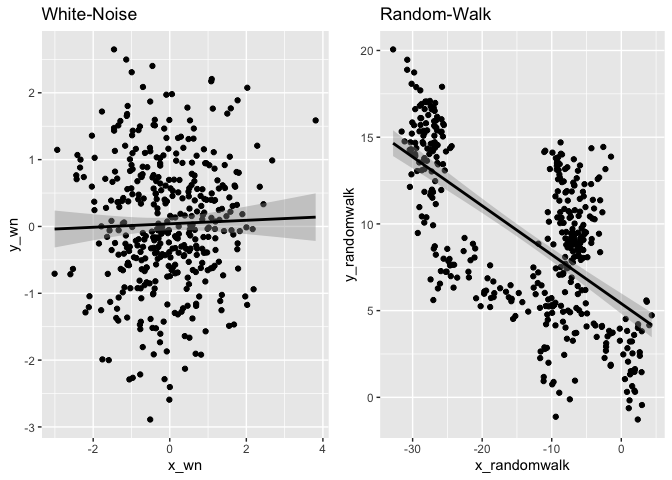
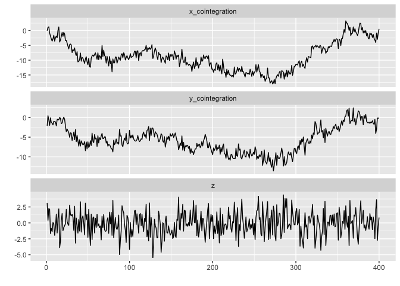

## 1-1.この章で用いるパッケージ

``` r
library(urca)
library(lmtest)
```

    ## Loading required package: zoo

    ## 
    ## Attaching package: 'zoo'

    ## The following objects are masked from 'package:base':
    ## 
    ##     as.Date, as.Date.numeric

``` r
library(prais)
```

    ## Loading required package: sandwich

    ## Loading required package: pcse

    ## 
    ## Attaching package: 'pcse'

    ## The following object is masked from 'package:sandwich':
    ## 
    ##     vcovPC

``` r
library(ggplot2)
library(ggfortify)
library(gridExtra)
```

## 1-2.ホワイトノイズへの回帰分析

-   全く関係ないデータ同士を回帰分析したとしても、有意な係数は得られないはず。
-   正規分布に従うホワイトノイズを複数発生させて、回帰分析を実行し、確認してみる。

``` r
# 1回のシミュレーションにおけるサンプルサイズ
n_sample <- 400

# 乱数の種
set.seed(1)

# シミュレーションデータの作成
y_wn <- rnorm(n = n_sample)
x_wn <- rnorm(n = n_sample)

# モデルの構築
model_ols_whitenoise <- lm(y_wn ~ x_wn)

# 結果の確認
summary(model_ols_whitenoise)
```

    ## 
    ## Call:
    ## lm(formula = y_wn ~ x_wn)
    ## 
    ## Residuals:
    ##      Min       1Q   Median       3Q      Max 
    ## -2.91553 -0.60756 -0.06449  0.65797  2.64718 
    ## 
    ## Coefficients:
    ##             Estimate Std. Error t value Pr(>|t|)
    ## (Intercept)  0.03993    0.04862   0.821    0.412
    ## x_wn         0.02605    0.04500   0.579    0.563
    ## 
    ## Residual standard error: 0.9704 on 398 degrees of freedom
    ## Multiple R-squared:  0.0008414,  Adjusted R-squared:  -0.001669 
    ## F-statistic: 0.3352 on 1 and 398 DF,  p-value: 0.563

-   Coefficientsの部分を見ると、有意な回帰係数が得られていないことがわかる。
-   また、決定係数や調整済み決定係数を見ても、説明力のないモデルであることがわかる。

## 1-3.単位根のあるデータ同士の回帰分析

-   次に、単位根のあるデータを対象に回帰分析を行う。
-   ホワイトノイズを累積和として、ランダムウォーク過程をシミュレート

``` r
# 乱数の設定
set.seed(1)

# ランダムウォークするデータ
y_randomwalk <- cumsum(rnorm(n = n_sample))
x_randomwalk <- cumsum(rnorm(n = n_sample))

# モデルの構築
model_ols_randomwalk <- lm(y_randomwalk ~ x_randomwalk)

# 結果の確認
summary(model_ols_randomwalk)
```

    ## 
    ## Call:
    ## lm(formula = y_randomwalk ~ x_randomwalk)
    ## 
    ## Residuals:
    ##     Min      1Q  Median      3Q     Max 
    ## -9.1820 -3.0629  0.4445  2.6711  8.3003 
    ## 
    ## Coefficients:
    ##              Estimate Std. Error t value Pr(>|t|)    
    ## (Intercept)   5.40661    0.29876   18.10   <2e-16 ***
    ## x_randomwalk -0.28189    0.01738  -16.22   <2e-16 ***
    ## ---
    ## Signif. codes:  0 '***' 0.001 '**' 0.01 '*' 0.05 '.' 0.1 ' ' 1
    ## 
    ## Residual standard error: 3.622 on 398 degrees of freedom
    ## Multiple R-squared:  0.398,  Adjusted R-squared:  0.3965 
    ## F-statistic: 263.1 on 1 and 398 DF,  p-value: < 2.2e-16

-   単位根を持ったデータの場合、p値が有意な回帰係数が得られたということを示している。
-   決定係数についても0.4程度となっており、比較的大きな値となっている。
-   このように全く関係のないデータ同士でも有意な回帰係数が得られてしまう現象を「見せかけの回帰」と呼ぶ。
-   実際にどのような回帰直線が引かれのかを図示してみる。

``` r
# ホワイトノイズの場合
## データの整形
df_whitenoise <- data.frame(x_wn = x_wn, y_wn = y_wn)

## ggplot2による図示
p_whitenoise <- ggplot(df_whitenoise, aes(x=x_wn, y=y_wn)) +   # 外枠
  geom_point() +                                               # 散布図の追加
  geom_smooth(method = "lm", colour = 1) +                     # 回帰直線の追加
  ggtitle("White-Noise")

# ランダムウォークの場合
## データの整形
df_randomwalk <- data.frame(x_randomwalk = x_randomwalk, y_randomwalk = y_randomwalk)

## ggplot2による図示
p_randomwalk <- ggplot(df_randomwalk, aes(x=x_randomwalk, y=y_randomwalk)) +   # 外枠
  geom_point() +                                                               # 散布図の追加
  geom_smooth(method = "lm", colour = 1) +                                     # 回帰直線の追加
  ggtitle("Random-Walk")

# 2つのグラフを表示
grid.arrange(p_whitenoise, p_randomwalk, ncol = 2)
```

    ## `geom_smooth()` using formula = 'y ~ x'
    ## `geom_smooth()` using formula = 'y ~ x'



## 1-4.定常AR過程への回帰分析

-   次は、単位根ではなく、定常AR過程に従うデータで回帰分析してどうなるか

``` r
# 乱数の設定
set.seed(2)

# 定常AR過程に従うデータ
y_ar <- arima.sim(
  n = n_sample,
  model = list(order = c(1,0,0), ar = c(0.8))
)
x_ar <- arima.sim(
  n = n_sample,
  model = list(order = c(1,0,0), ar = c(0.8))
)

# モデルの構築
model_ols_ar <- lm(y_ar ~ x_ar)

# 結果の表示
summary(model_ols_ar)
```

    ## 
    ## Call:
    ## lm(formula = y_ar ~ x_ar)
    ## 
    ## Residuals:
    ##     Min      1Q  Median      3Q     Max 
    ## -4.8320 -1.3404  0.0591  1.2246  4.6444 
    ## 
    ## Coefficients:
    ##             Estimate Std. Error t value Pr(>|t|)    
    ## (Intercept)  0.47574    0.08906   5.342 1.55e-07 ***
    ## x_ar        -0.13483    0.04938  -2.731   0.0066 ** 
    ## ---
    ## Signif. codes:  0 '***' 0.001 '**' 0.01 '*' 0.05 '.' 0.1 ' ' 1
    ## 
    ## Residual standard error: 1.754 on 398 degrees of freedom
    ## Multiple R-squared:  0.01839,    Adjusted R-squared:  0.01592 
    ## F-statistic: 7.456 on 1 and 398 DF,  p-value: 0.006604

-   p値が0.05以下なので、見せかけの回帰

## 1-5.残差の自己相関と見せかけの回帰

-   見せかけの回帰が発生してしまう大きな理由は「残差に自己相関がある」ということ
-   残差に自己相関がある場合、最小二乗推定量における有効性が失われてしまう。
-   つまり、推定されたパラメタが「最も分散が小さい推定量である」という保証が得られないということに。
-   残差に対して正の自己相関があった場合、以下の問題が発生する。
    -   係数の分散を過小推定してしまう
    -   決定係数*R*<sup>2</sup>が過大となってしまう。
    -   係数の*t*検定が使えなくなる。
-   残差に自己相関があるということは「まだモデルに組み込むことができていない時系列データの構造が残っている」ということ。

## 1-6.Durbin-Watson検定

-   次に残差の自己相関の有無を調べる方法について。
-   1つ手法であり、多く使われる手法として、Durwin-Watson検定(DW検定)がある。
-   DW統計量の定義は以下の通り。サンプルサイズは*T*。

$$
DW = \frac{\sum\_{t=2}^T(\hat{u}\_t - \hat{u}\_{t-1})^2}{\sum\_{t=1}^T\hat{u}\_t^2}
$$
 - *û*<sub>*t*</sub>は以下の回帰式の残差にあたる。

*y*<sub>*t*</sub> = *β*<sub>0</sub> + *β*<sub>1</sub>*x*<sub>*t*</sub> + *u*<sub>*t*</sub>

-   残差の1次の自己相関が0であった場合は、DW統計量はおよそ2
-   つまり、2からどれほど離れているかを確認することで残差の自己相関について検討がつく。
-   また、説明変数が複数個(*r*個)持つような重回帰分析の場合でも利用可能

$$
y_t = \beta_0 + \sum\_{k=1}^r{\beta_k x\_{k,t}} + u_t
$$

``` r
# DW統計量
residuals_ols <- model_ols_randomwalk$residuals
dw <- sum(diff(residuals_ols)^2) / sum((residuals_ols)^2)
dw
```

    ## [1] 0.08021259

-   residuals_ols：回帰式の残差であり、*û*<sub>*t*</sub>を表現してる。

-   結果としてDW統計量が2よりもかなり小さい値となったため、自己相関があるだろうということがわかる。

-   「サンプルサイズ」と「推定されたパラメータ数」が分かれば、棄却点が計算可能。

-   そのため、DW統計量を用いて、残差の自己相関の検定を行うことができる。

-   この時の帰無仮説は「自己相関が0である」ということ。

-   Rでは、lmtestのdwtest関数を用いることで実行可能。

``` r
# ホワイトノイズ
dwtest(model_ols_whitenoise)
```

    ## 
    ##  Durbin-Watson test
    ## 
    ## data:  model_ols_whitenoise
    ## DW = 2.0935, p-value = 0.8261
    ## alternative hypothesis: true autocorrelation is greater than 0

``` r
# ランダムウォーク
dwtest(model_ols_randomwalk)
```

    ## 
    ##  Durbin-Watson test
    ## 
    ## data:  model_ols_randomwalk
    ## DW = 0.080213, p-value < 2.2e-16
    ## alternative hypothesis: true autocorrelation is greater than 0

``` r
# AR過程
dwtest(model_ols_ar)
```

    ## 
    ##  Durbin-Watson test
    ## 
    ## data:  model_ols_ar
    ## DW = 0.3874, p-value < 2.2e-16
    ## alternative hypothesis: true autocorrelation is greater than 0

-   ランダムウォーク過程とAR(1)過程については、p値から帰無仮説が棄却されることがわかる。

## 1-7.シミュレーションによる見せかけの回帰

-   見せかけの回帰がどのくらいの頻度で発生するのかをシミュレーションで確認。

-   まずは、回帰分析の結果からp値を取得する。

``` r
summary(model_ols_whitenoise)$coefficients["x_wn", "Pr(>|t|)"]
```

    ## [1] 0.5629569

-   推定されたp値等を格納するための変数などを定義し、シミュレーションを実行

``` r
# シミュレーションの回数
n_sim <- 200

# 1度のシミュレーションにおけるサンプルサイズ
n_sample <- 400

# p値を格納する変数
p_whitenoise <- numeric(n_sim)
p_randomwalk <- numeric(n_sim)

set.seed(1)

for(i in 1:n_sim){
  # 自己相関のないシミュレーションデータ
  y_whitenoise <- rnorm(n = n_sample)
  x_whitenoise <- rnorm(n = n_sample)
  
  # 線形回帰分析の実行
  model_whitenoise <- lm(y_whitenoise ~ x_whitenoise)
  
  # p値を保存
  p_whitenoise[i] <- summary(model_whitenoise)$coefficients["x_whitenoise", "Pr(>|t|)"]
  
  
  # ランダムウォークのシミュレーションデータ
  y_randomwalk <- cumsum(rnorm(n = n_sample))
  x_randomwalk <- cumsum(rnorm(n = n_sample))
  
  # 線形回帰分析の実行
  model_randomwalk <- lm(y_randomwalk ~ x_randomwalk)
  
  # p値を保存
  p_randomwalk[i] <- summary(model_randomwalk)$coefficients["x_randomwalk", "Pr(>|t|)"]
}

# 有意となった割合を算出する
# TRUEだった場合1を吐き出すので、それを利用して、回数を合計し、シミュレーション回数で割る
## ホワイトノイズ
sum(p_whitenoise < 0.05) / n_sim
```

    ## [1] 0.055

``` r
## ランダムウォーク
sum(p_randomwalk < 0.05) / n_sim
```

    ## [1] 0.85

-   ランダムウォーク系列に対して回帰分析を実行すると非常に高い割合で見せかけの回帰が起こる。

## 1-8.見せかけの回帰を防ぐ方法

-   見せかけの回帰を防ぐ方法として、過去のデータをモデルに組み込み、データの持つ自己相関を表現するモデルを作るというもの。
-   例として、「ARIMAX」「ベクトル自己回帰(VAR)」「状態空間モデル」等。
-   残差の自己相関を明示的にモデルに組み込む回帰モデルとして、一般化最小二乗法(GLS)がある。
-   差分系列を用いることで、見せかけの回帰は防げるものの、「共和分」という問題が発生するらしい。
-   今後は、以下のような流れ。
    1.  「検定：単位根の有無」「有：2へ」「無：一般化最小二乗法」
    2.  「確認：共和分の有無」「有：???」「無：差分系列への回帰分析」

## 1-9.単位根検定

``` r
# ランダムウォークのADF検定
summary(ur.df(y_randomwalk, type = "none"))
```

    ## 
    ## ############################################### 
    ## # Augmented Dickey-Fuller Test Unit Root Test # 
    ## ############################################### 
    ## 
    ## Test regression none 
    ## 
    ## 
    ## Call:
    ## lm(formula = z.diff ~ z.lag.1 - 1 + z.diff.lag)
    ## 
    ## Residuals:
    ##      Min       1Q   Median       3Q      Max 
    ## -2.69362 -0.76935 -0.01875  0.61984  3.10863 
    ## 
    ## Coefficients:
    ##             Estimate Std. Error t value Pr(>|t|)
    ## z.lag.1    -0.007932   0.008430  -0.941    0.347
    ## z.diff.lag -0.037636   0.050540  -0.745    0.457
    ## 
    ## Residual standard error: 1 on 396 degrees of freedom
    ## Multiple R-squared:  0.004097,   Adjusted R-squared:  -0.0009326 
    ## F-statistic: 0.8146 on 2 and 396 DF,  p-value: 0.4436
    ## 
    ## 
    ## Value of test-statistic is: -0.9409 
    ## 
    ## Critical values for test statistics: 
    ##       1pct  5pct 10pct
    ## tau1 -2.58 -1.95 -1.62

``` r
summary(ur.df(x_randomwalk, type = "none"))
```

    ## 
    ## ############################################### 
    ## # Augmented Dickey-Fuller Test Unit Root Test # 
    ## ############################################### 
    ## 
    ## Test regression none 
    ## 
    ## 
    ## Call:
    ## lm(formula = z.diff ~ z.lag.1 - 1 + z.diff.lag)
    ## 
    ## Residuals:
    ##     Min      1Q  Median      3Q     Max 
    ## -2.4968 -0.6984  0.0219  0.8117  3.0420 
    ## 
    ## Coefficients:
    ##              Estimate Std. Error t value Pr(>|t|)
    ## z.lag.1    -0.0008817  0.0030911  -0.285    0.776
    ## z.diff.lag -0.0148436  0.0501355  -0.296    0.767
    ## 
    ## Residual standard error: 1.04 on 396 degrees of freedom
    ## Multiple R-squared:  0.0004466,  Adjusted R-squared:  -0.004602 
    ## F-statistic: 0.08847 on 2 and 396 DF,  p-value: 0.9153
    ## 
    ## 
    ## Value of test-statistic is: -0.2852 
    ## 
    ## Critical values for test statistics: 
    ##       1pct  5pct 10pct
    ## tau1 -2.58 -1.95 -1.62

-   共に、棄却域に満たないため、帰無仮説（単位根である）を棄却することができなかった。

``` r
# 定常AR(1)過程へのADF検定
summary(ur.df(y_ar, type = "none"))
```

    ## 
    ## ############################################### 
    ## # Augmented Dickey-Fuller Test Unit Root Test # 
    ## ############################################### 
    ## 
    ## Test regression none 
    ## 
    ## 
    ## Call:
    ## lm(formula = z.diff ~ z.lag.1 - 1 + z.diff.lag)
    ## 
    ## Residuals:
    ##      Min       1Q   Median       3Q      Max 
    ## -2.74469 -0.63356  0.06323  0.80719  2.93191 
    ## 
    ## Coefficients:
    ##            Estimate Std. Error t value Pr(>|t|)    
    ## z.lag.1    -0.17793    0.03005  -5.921 6.94e-09 ***
    ## z.diff.lag  0.01998    0.05042   0.396    0.692    
    ## ---
    ## Signif. codes:  0 '***' 0.001 '**' 0.01 '*' 0.05 '.' 0.1 ' ' 1
    ## 
    ## Residual standard error: 1.037 on 396 degrees of freedom
    ## Multiple R-squared:  0.08589,    Adjusted R-squared:  0.08128 
    ## F-statistic:  18.6 on 2 and 396 DF,  p-value: 1.894e-08
    ## 
    ## 
    ## Value of test-statistic is: -5.9211 
    ## 
    ## Critical values for test statistics: 
    ##       1pct  5pct 10pct
    ## tau1 -2.58 -1.95 -1.62

``` r
summary(ur.df(x_ar, type = "none"))
```

    ## 
    ## ############################################### 
    ## # Augmented Dickey-Fuller Test Unit Root Test # 
    ## ############################################### 
    ## 
    ## Test regression none 
    ## 
    ## 
    ## Call:
    ## lm(formula = z.diff ~ z.lag.1 - 1 + z.diff.lag)
    ## 
    ## Residuals:
    ##      Min       1Q   Median       3Q      Max 
    ## -2.74208 -0.64145  0.02012  0.75412  2.67069 
    ## 
    ## Coefficients:
    ##            Estimate Std. Error t value Pr(>|t|)    
    ## z.lag.1    -0.16599    0.02913  -5.699 2.36e-08 ***
    ## z.diff.lag -0.01398    0.04998  -0.280     0.78    
    ## ---
    ## Signif. codes:  0 '***' 0.001 '**' 0.01 '*' 0.05 '.' 0.1 ' ' 1
    ## 
    ## Residual standard error: 1.004 on 396 degrees of freedom
    ## Multiple R-squared:  0.08459,    Adjusted R-squared:  0.07996 
    ## F-statistic:  18.3 on 2 and 396 DF,  p-value: 2.513e-08
    ## 
    ## 
    ## Value of test-statistic is: -5.699 
    ## 
    ## Critical values for test statistics: 
    ##       1pct  5pct 10pct
    ## tau1 -2.58 -1.95 -1.62

-   こちらの場合は、棄却域を満たしているので、帰無仮説を棄却し、単位根はなしとなる。

## 1-10.一般化最小二乗法：GLS

-   自己相関を持つデータの場合は、OLSではなく、GLS。
-   GLSは、残差の自己相関を明示的にモデルに組み込んだ上で、パラメータ推定する。
-   ただし、実際の現場において、自己相関が最初からわかっていることはない。
    1.  自己相関に関わるパラメータOLSで推定
    2.  推定したパラメータを使ってデータを変換
    3.  そのデータで再度OLS
-   OLSを何度も繰り返し、自己相関のあるデータに対してパラメータを推定する手法を実行可能一般化最小二乗法(FGLS)という。
-   やっていることは、残差を使って回帰モデルを作成し、そのパラメータを用いて、元のデータを変換するということ。
-   この手法をPrais-Winsten法という。

## 1-11.RによるPrais-Winsten法

``` r
# Step 1
## 定常AR(1)過程に従うデータをOLSでモデル化
model_ols_ar <- lm(y_ar ~ x_ar)

## 残差
residuals_ols_ar <- model_ols_ar$residuals

## 残差に対してOLSをし、残差の自己相関を表すpを推定
model_residuals <- lm(residuals_ols_ar[-1] ~ residuals_ols_ar[-n_sample] - 1)
p <- as.numeric(model_residuals$coefficients)
p
```

    ## [1] 0.8078253

``` r
# Step 2
## 初期時点のデータを変換
y_transform_1 <- sqrt(1 - p^2) * y_ar[1]
x_transform_1 <- sqrt(1 - p^2) * x_ar[1]
psi_transform_1 <- sqrt(1 - p^2)

## 2時点〜399時点までを変換
y_transform_2 <- y_ar[-1] - p * y_ar[-n_sample]
x_transform_2 <- x_ar[-1] - p * x_ar[-n_sample]
psi_transform_2 <- rep(1-p, n_sample-1)

## それぞれを結合
y_transform_all <- c(y_transform_1, y_transform_2)
x_transform_all <- c(x_transform_1, x_transform_2)
psi_transform_all <- c(psi_transform_1, psi_transform_2)
```

``` r
# OLS
model_gls_hand <- lm(y_transform_all ~ psi_transform_all + x_transform_all - 1)
summary(model_gls_hand)
```

    ## 
    ## Call:
    ## lm(formula = y_transform_all ~ psi_transform_all + x_transform_all - 
    ##     1)
    ## 
    ## Residuals:
    ##      Min       1Q   Median       3Q      Max 
    ## -2.80161 -0.72467 -0.01121  0.72617  2.82948 
    ## 
    ## Coefficients:
    ##                   Estimate Std. Error t value Pr(>|t|)  
    ## psi_transform_all  0.46817    0.26604   1.760   0.0792 .
    ## x_transform_all   -0.01720    0.05135  -0.335   0.7378  
    ## ---
    ## Signif. codes:  0 '***' 0.001 '**' 0.01 '*' 0.05 '.' 0.1 ' ' 1
    ## 
    ## Residual standard error: 1.032 on 398 degrees of freedom
    ## Multiple R-squared:  0.007859,   Adjusted R-squared:  0.002873 
    ## F-statistic: 1.576 on 2 and 398 DF,  p-value: 0.208

-   結果として、p値が0.7378ということで、有意な回帰係数は得られないという結果に。
-   つまり、見せかけの回帰を回避できたということ。

## 1-12.パッケージを使ったGLS

-   praisパッケージのprais.winsten関数を使用。（data.frame型のみ受付）

``` r
# 型変換
d <- data.frame(
  y_ar = y_ar,
  x_ar = x_ar
)
#class(y_ar)

# Prais-Winsten
model_gls_PW <- prais_winsten(y_ar ~ x_ar, data = d,index = 1:nrow(d), max_iter = 1)
```

    ## Iteration 0: rho = 0
    ## Iteration 1: rho = 0.8078

    ## Estimation was stopped, because the maximum number of iterations was reached.

``` r
model_gls_PW
```

    ## 
    ## Call:
    ## prais_winsten(formula = y_ar ~ x_ar, data = d, index = 1:nrow(d), 
    ##     max_iter = 1)
    ## 
    ## Coefficients:
    ## (Intercept)         x_ar  
    ##      0.4682      -0.0172  
    ## 
    ## AR(1) coefficient rho: 0.8078

-   Iterationsを増やすことで、繰り返し残差の計算〜変換を行うことができる。

## 1-13.差分系列への回帰分析

-   単位根があるデータへの回帰分析-\>差分系列を回帰分析👌

``` r
model_lm_diff <- lm(diff(y_randomwalk) ~ diff(x_randomwalk))
summary(model_lm_diff)
```

    ## 
    ## Call:
    ## lm(formula = diff(y_randomwalk) ~ diff(x_randomwalk))
    ## 
    ## Residuals:
    ##      Min       1Q   Median       3Q      Max 
    ## -2.63491 -0.73367  0.04338  0.65956  3.14882 
    ## 
    ## Coefficients:
    ##                    Estimate Std. Error t value Pr(>|t|)
    ## (Intercept)        -0.02864    0.05012  -0.571    0.568
    ## diff(x_randomwalk) -0.01742    0.04818  -0.362    0.718
    ## 
    ## Residual standard error: 1.001 on 397 degrees of freedom
    ## Multiple R-squared:  0.0003292,  Adjusted R-squared:  -0.002189 
    ## F-statistic: 0.1307 on 1 and 397 DF,  p-value: 0.7179

## 1-14.共和分

-   単位根を持つデータ同士で回帰分析すると見せかけの回帰になることが多い
-   例外として、共和分を持っているとならない。
-   共和分：データ *y*<sub>*t*</sub> と *x*<sub>*t*</sub>
    がそれぞれ単位根を持っているが、*y*<sub>*t*</sub> と
    *x*<sub>*t*</sub>の線型結合では単位根を持たなくなる関係
-   共和分関係を持つデータの特徴をシミュレーション。

``` r
set.seed(10)

# データセット作成
randomwalk <- cumsum(rnorm(n = n_sample))
x_cointegration <- 0.6 * randomwalk + rnorm(n = n_sample)
y_cointegration <- 0.4 * randomwalk + rnorm(n = n_sample)

# ADF検定で単位根を持つことの確認
summary(ur.df(y_cointegration, type = "none"))
```

    ## 
    ## ############################################### 
    ## # Augmented Dickey-Fuller Test Unit Root Test # 
    ## ############################################### 
    ## 
    ## Test regression none 
    ## 
    ## 
    ## Call:
    ## lm(formula = z.diff ~ z.lag.1 - 1 + z.diff.lag)
    ## 
    ## Residuals:
    ##     Min      1Q  Median      3Q     Max 
    ## -4.0281 -0.8282 -0.0794  0.8101  3.4312 
    ## 
    ## Coefficients:
    ##             Estimate Std. Error t value Pr(>|t|)    
    ## z.lag.1    -0.012165   0.009448  -1.288    0.199    
    ## z.diff.lag -0.453423   0.044548 -10.178   <2e-16 ***
    ## ---
    ## Signif. codes:  0 '***' 0.001 '**' 0.01 '*' 0.05 '.' 0.1 ' ' 1
    ## 
    ## Residual standard error: 1.236 on 396 degrees of freedom
    ## Multiple R-squared:  0.2162, Adjusted R-squared:  0.2122 
    ## F-statistic: 54.62 on 2 and 396 DF,  p-value: < 2.2e-16
    ## 
    ## 
    ## Value of test-statistic is: -1.2875 
    ## 
    ## Critical values for test statistics: 
    ##       1pct  5pct 10pct
    ## tau1 -2.58 -1.95 -1.62

``` r
summary(ur.df(x_cointegration, type = "none"))
```

    ## 
    ## ############################################### 
    ## # Augmented Dickey-Fuller Test Unit Root Test # 
    ## ############################################### 
    ## 
    ## Test regression none 
    ## 
    ## 
    ## Call:
    ## lm(formula = z.diff ~ z.lag.1 - 1 + z.diff.lag)
    ## 
    ## Residuals:
    ##     Min      1Q  Median      3Q     Max 
    ## -4.6304 -1.0182 -0.0304  0.8609  4.3365 
    ## 
    ## Coefficients:
    ##             Estimate Std. Error t value Pr(>|t|)    
    ## z.lag.1    -0.007435   0.007294  -1.019    0.309    
    ## z.diff.lag -0.418492   0.045650  -9.167   <2e-16 ***
    ## ---
    ## Signif. codes:  0 '***' 0.001 '**' 0.01 '*' 0.05 '.' 0.1 ' ' 1
    ## 
    ## Residual standard error: 1.436 on 396 degrees of freedom
    ## Multiple R-squared:  0.1803, Adjusted R-squared:  0.1762 
    ## F-statistic: 43.57 on 2 and 396 DF,  p-value: < 2.2e-16
    ## 
    ## 
    ## Value of test-statistic is: -1.0194 
    ## 
    ## Critical values for test statistics: 
    ##       1pct  5pct 10pct
    ## tau1 -2.58 -1.95 -1.62

-   線形結合したら、ホワイトノイズとなってしまうことを図示して確認

``` r
# データを1つのdata.frameにまとめる
df <- data.frame(
  y_cointegration = y_cointegration,
  x_cointegration = x_cointegration,
  z = x_cointegration - (0.6/0.4)*y_cointegration  # 線形結合
)

# ts型に変換
ts_df <- ts(df)

# 図示
autoplot(ts_df, facets = T)  # 複数の時系列に分けたグラフを描く
```



## 1-15.共和分検定

-   Engle-Grangerの手法で検定してみる。
-   この手法は２変数での共和分関係を調べることにしか使えない。
-   手順としては下記の通り。
    1.  単位根を持つデータに対して、OLS
    2.  残差を計算
    3.  残差に対して単位根検定-\>単位根がなくなれば、共和分関係である。
-   手順3の検定に関しては、残差に対しての検定になるので、ADF検定、KPSS検定は使用不可
-   Phillips-Ouliaris検定(PO検定)を用いる。帰無仮説は「共和分関係がない」こと。

``` r
# データの整形
data_matrix <- matrix(nrow = n_sample, ncol = 2)
data_matrix[,1] <- y_cointegration
data_matrix[,2] <- x_cointegration

# 共和分検定
summary(ca.po(data_matrix, demean = "none"))  # 定数項もトレンドもないことを過程してモデル化している。
```

    ## 
    ## ######################################## 
    ## # Phillips and Ouliaris Unit Root Test # 
    ## ######################################## 
    ## 
    ## Test of type Pu 
    ## detrending of series none 
    ## 
    ## 
    ## Call:
    ## lm(formula = z[, 1] ~ z[, -1] - 1)
    ## 
    ## Residuals:
    ##     Min      1Q  Median      3Q     Max 
    ## -3.0870 -0.8575 -0.0049  0.7570  3.5471 
    ## 
    ## Coefficients:
    ##         Estimate Std. Error t value Pr(>|t|)    
    ## z[, -1] 0.655250   0.006071   107.9   <2e-16 ***
    ## ---
    ## Signif. codes:  0 '***' 0.001 '**' 0.01 '*' 0.05 '.' 0.1 ' ' 1
    ## 
    ## Residual standard error: 1.199 on 399 degrees of freedom
    ## Multiple R-squared:  0.9669, Adjusted R-squared:  0.9668 
    ## F-statistic: 1.165e+04 on 1 and 399 DF,  p-value: < 2.2e-16
    ## 
    ## 
    ## Value of test-statistic is: 250.7453 
    ## 
    ## Critical values of Pu are:
    ##                   10pct    5pct    1pct
    ## critical values 20.3933 25.9711 38.3413

``` r
# 共和分のあるデータに、差分とってから回帰
y_cointegration_diff <- diff(y_cointegration)
x_cointegration_diff <- diff(x_cointegration)

model_lm_diff_cointegration <- lm(y_cointegration_diff ~ x_cointegration_diff)
summary(model_lm_diff_cointegration)
```

    ## 
    ## Call:
    ## lm(formula = y_cointegration_diff ~ x_cointegration_diff)
    ## 
    ## Residuals:
    ##     Min      1Q  Median      3Q     Max 
    ## -4.0064 -0.9438 -0.0613  0.9665  3.7408 
    ## 
    ## Coefficients:
    ##                      Estimate Std. Error t value Pr(>|t|)
    ## (Intercept)          0.004719   0.070014   0.067    0.946
    ## x_cointegration_diff 0.047463   0.044286   1.072    0.284
    ## 
    ## Residual standard error: 1.399 on 397 degrees of freedom
    ## Multiple R-squared:  0.002885,   Adjusted R-squared:  0.0003732 
    ## F-statistic: 1.149 on 1 and 397 DF,  p-value: 0.2845

-   上記のように共和分関係にあるデータに対して、差分系列への回帰分析をすると、本来の関係が見えなくなる。
-   このために、差分を取ることには注意が必要になってくる。
