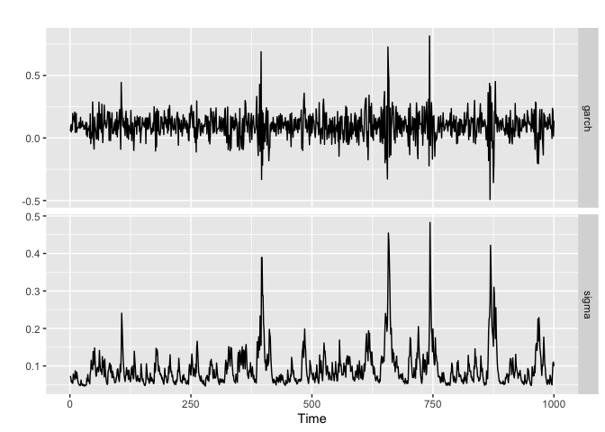
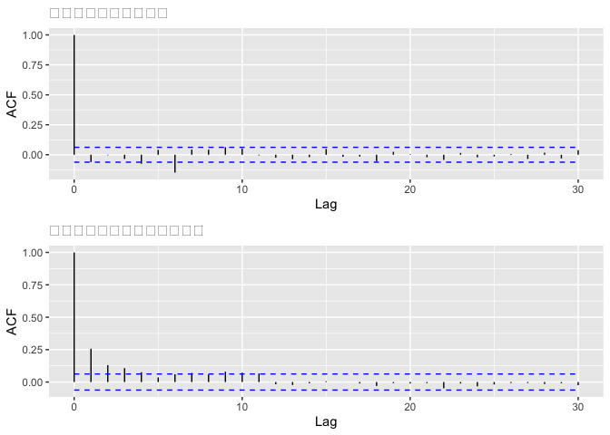
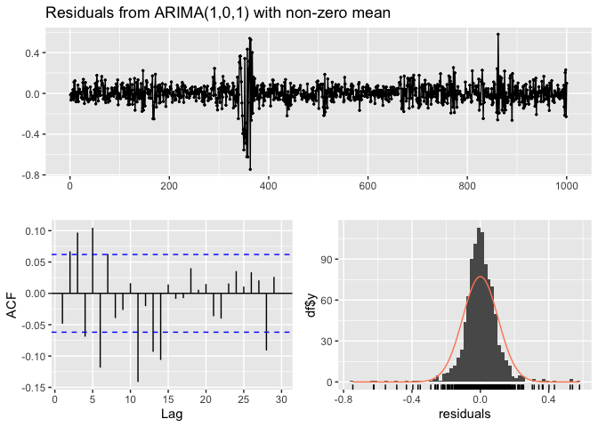
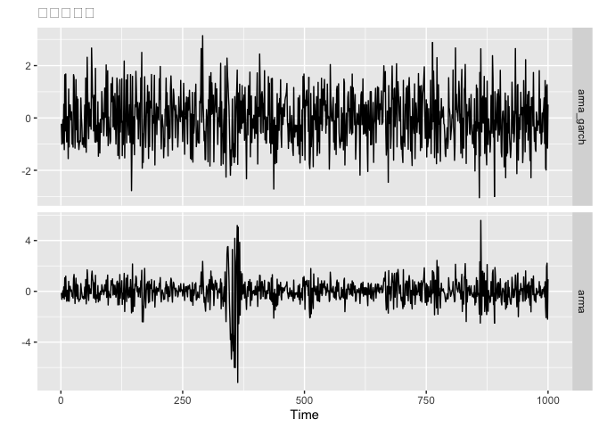
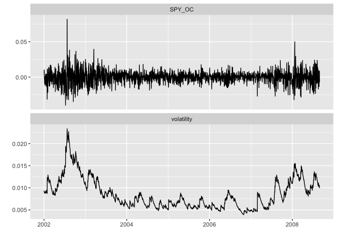

## 3-1.なぜ分散の大きさをモデル化したいのか

-   定常過程では分散が一定を仮定されているが、ファイナンス系のデータではそうはいかない。
-   実際、ファイナンス分野では、それを図る指標として、分散の平方根である標準偏差がある。用語として、”ボラティリティ”という。
-   モチベーションとしては、株式投資時に「最大どれくらい損をする可能性があるのか」というところを図り、リスクマネジメントすること。
-   このボラティリティを予測するモデルのことを、ボラティリティ変動モデルといい、リスク管理に役立つ。

## 3-2.自己回帰条件付き分散不均一モデル(ARCH)

-   最初は、自己回帰条件付き分散不均一モデル(AutoRegressive Conditional
    Heteroskedasticity model : ARCH)を使う。
-   このモデルは「絶対値が大きなノイズが前回来たらならば、今回の分散は大きくなるだろう」と考えるモデル。
-   これは、「データのブレ幅が広がる状況が持続する」という意味。
-   ARCH(1)は以下のように定式化。

$$
\begin{align}
y_t &= \mu_t + u_t\\\\
u_t &= \sqrt{h_t}\varepsilon_t \~\~\~\~\~\~\~\~\~\~ \varepsilon_t \sim N(0,1)\\\\
h_t &= \omega + \alpha_1u\_{t-1}^2
\end{align}
$$

-   上記の式を日本語で書き下すと。
    -   *デ**ー**タ* = *期**待**値* + *ノ**イ**ズ*
    -   $ノイズ = \sqrt{条件付き分散} \times 分散1のホワイトノイズ$
    -   *条**件**付**き**分**散* = *ω* + *a*<sub>1</sub>(*前**期**の**ノ**イ**ズ*)<sup>2</sup>
-   3つ目の式については、分散であり、その平方根がボラティリティである。
-   そのため、 *ω*, *α*<sub>1</sub> は0以上であるという制約が付く。

## 3-3.一般化ARCHモデル(GARCH)

-   一般化自己回帰条件付き分散不一致モデル(Generalized ARCH model)
-   一般化することへのモチベーションは「”より長く”データのブレ幅が広がる状況が持続する」時系列モデルを
    「少ないパラメータ」で表現したいということ。
-   ARCH(m)の次数を増やすとm時点前までのノイズの大きさが加味されるため、ボラティリティが大きくなる状況は持続される。
-   ただ、その分パラメータが比例的に増えてしまう。
-   そこでGARCH。GARCH(1,1)は以下のように定式化。

$$
\begin{align}
y_t &= \mu_t + u_t\\\\
u_t &= \sqrt{h_t}\varepsilon_t \~\~\~\~\~\~\~\~\~\~ \varepsilon_t \sim N(0,1)\\\\
h_t &= \omega + \alpha_1u\_{t-1}^2 + \beta_1h\_{t-1}
\end{align}
$$

-   上記の式を日本語で書き下すと。
    -   *デ**ー**タ* = *期**待**値* + *ノ**イ**ズ*
    -   $ノイズ = \sqrt{条件付き分散} \times 分散1のホワイトノイズ$
    -   *条**件**付**き**分**散* = *ω* + *a*<sub>1</sub>(*前**期**の**ノ**イ**ズ*)<sup>2</sup> + *β*<sub>1</sub> × *前**期**の**条**件**付**き**分**散*

## 3-4.GARCHモデルの拡張

-   GJR：正のノイズと負のノイズでは、分散に与える影響が異なると考える。
-   確率分布を正規分布ではなく、t分布に置き換えることでうまくいくこともある。

## 3-5.この章で使うパッケージ

``` r
library(xts)
library(fGarch)
library(rugarch)
library(forecast)
library(tseries)
library(ggplot2)
library(ggfortify)
library(gridExtra)
```

## 3-6.シミュレーションによるデータの作成

``` r
# 1回のシミュレーションにおけるサンプルサイズ
n_sample <- 1000

# GARCH(1,1)に従うデータのシミュレーション
# モデルのパラメタの設定
spec1 <- garchSpec(
  model = list(omega = 0.001, alpha = 0.4, beta = 0.5, mu = 0.1),
  cond.dist = "norm"
)
```

-   以下のモデルが作られる。

$$
\begin{align}
y_t &= 0.1 + u_t\\\\
u_t &= \sqrt{h_t}\varepsilon_t \~\~\~\~\~\~\~\~\~\~ \varepsilon_t \sim N(0,1)\\\\
h_t &= 0.001 + 0.4u\_{t-1}^2 + 0.5h\_{t-1}
\end{align}
$$

``` r
# シミュレーションデータを作成
set.seed(1)
sim_garch <- garchSim(
  spec1,
  n = n_sample,
  extended = T  # ボラティリティの値を出力
)

# 作成されたデータの中身を見る
## ts型に変換
sim_garch <- ts(sim_garch)

## データの表示
head(sim_garch, n = 2)
```

    ##           garch      sigma         eps
    ## [1,] 0.05450176 0.07334089 -0.62036668
    ## [2,] 0.10283070 0.06721219  0.04211587

``` r
## 図示
autoplot(sim_garch[, -3], facets = T, ylab = "")
```



``` r
# 原系列のコレログラムを作成
p_acf <- autoplot(
  acf(sim_garch[, "garch"], plot = F),
  main = "原系列のコレログラム"
)

# 2条した系列のコレログラムの作成
p_acf_sqrt <- autoplot(
  acf(sim_garch[, "garch"]^2, plot = F),
  main = "２条した系列のコレログラム"
)

# グラフを並べて表示
grid.arrange(p_acf, p_acf_sqrt, ncol = 1)
```



-   2条して正負の符号をなくすことで、自己相関を検出できる。

## 3-7.fGarchパッケージによるGARCHモデル

``` r
# モデル化
model_fGarch <- garchFit(
  formula = ~ garch(1,1),
  data = sim_garch[, "garch"],
  include.mean = T,
  trace = F
)

# 結果を確認
coef(model_fGarch)
```

    ##          mu       omega      alpha1       beta1 
    ## 0.100912052 0.001170366 0.417202664 0.502388109

## 3-8.rugarchパッケージによるGARCHモデル

``` r
# モデルの構造の設定
spec_rugarch1 <- ugarchspec(
  variance.model = list(model = "sGARCH", garchOrder = c(1,1)),
  mean.model = list(armaOrder = c(0,0), include.mean = TRUE),
  distribution.model = "norm"
)

# モデルの推定
model_rugarch <- ugarchfit(
  spec = spec_rugarch1, 
  data = sim_garch[, "garch"], 
  solver = 'hybrid'
)

# 結果の確認
coef(model_rugarch)
```

    ##          mu       omega      alpha1       beta1 
    ## 0.100912528 0.001169216 0.418498397 0.502175324

## 3-9.ARMA-GARCHモデルの作成

-   期待値が一定であるという前提でモデルを組んでいた。
-   しかし、ARMAモデルのように「前の時点の値によって期待値が変わる」構造になることもある。

``` r
# モデルのパラメータの設定
spec2 <- garchSpec(
  model = list(
    omega = 0.001, alpha = 0.5, beta = 0.4,
    mu = 0.1, ar = -0.6, ma = -0.5
  ),
  cond.dist = "norm"
)

# シミュレーションデータの生成
set.seed(0)
sim_arma_garch <- garchSim(
  spec2,
  n = n_sample,
  extended = F
)
```

``` r
# ARMA(1,1)モデル
model_arma <- Arima(sim_arma_garch, order = c(1,0,1))

# 残差のチェック
checkresiduals(model_arma)
```



    ## 
    ##  Ljung-Box test
    ## 
    ## data:  Residuals from ARIMA(1,0,1) with non-zero mean
    ## Q* = 52.804, df = 8, p-value = 1.177e-08
    ## 
    ## Model df: 2.   Total lags used: 10

``` r
jarque.bera.test(model_arma$residuals)
```

    ## 
    ##  Jarque Bera Test
    ## 
    ## data:  model_arma$residuals
    ## X-squared = 3617.7, df = 2, p-value < 2.2e-16

-   Ljung-Box test も jarque.bera.test もともに有意となった。
-   つまり、残差には自己相関があり、正規分布には従わないということ。-\>❌

``` r
# モデルの構造の設定
spec_rugarch2 <- ugarchspec(
  variance.model = list(model = "sGARCH", garchOrder = c(1,1)),
  mean.model = list(armaOrder=c(1,1), include.mean=TRUE),
  distribution.model = "norm"
)

# モデルの推定
model_arma_garch <- ugarchfit(
  spec = spec_rugarch2, data = sim_arma_garch, solver = 'hybrid'
)

# 結果の確認
coef(model_arma_garch)
```

    ##            mu           ar1           ma1         omega        alpha1 
    ##  0.0619507415 -0.5976675284 -0.5049524589  0.0008803717  0.4498009189 
    ##         beta1 
    ##  0.4691978114

``` r
# 標準化残差：ARMA+GARCH
residuals_arma_garch <- residuals(model_arma_garch) / sigma(model_arma_garch)

# 標準化残差：ARMA
residuals_arma <- model_arma$residuals / sqrt(model_arma$sigma2)

# データをまとめる
d <- data.frame(
  arma_garch = residuals_arma_garch,
  arma = residuals_arma
)

# 図示
autoplot(ts(d), facets = T, ylab = "", main = "標準化残差")
```



## 3-10.RによるGJRモデル

-   GJRモデル(正と負のノイズに違い)の推定。
-   データspyreal：アメリカの株式インデックスデータ

``` r
data("spyreal")

tail(spyreal, n=2)
```

    ##                  SPY_OC      SPY_RK
    ## 2008-08-28  0.008478546 0.004827752
    ## 2008-08-29 -0.007352690 0.004913831

``` r
# モデルの構造指定
spec_rugarch3 <- ugarchspec(
  variance.model = list(model="gjrGARCH", garchOrder=c(1,1)),
  mean.model     = list(armaOrder=c(1,1)),
  distribution.model = "std"  # 確率分布をt分布に変更
)

# GJR GARCHの推定
model_gjr <- ugarchfit(
  spec = spec_rugarch3,
  data = spyreal[,1],
  solver = 'hybrid'
)

# 結果の確認
coef(model_gjr)
```

    ##            mu           ar1           ma1         omega        alpha1 
    ## -4.376696e-05  5.681898e-01 -6.380939e-01  3.862120e-07  1.619408e-07 
    ##         beta1        gamma1         shape 
    ##  9.528254e-01  7.936122e-02  1.503204e+01

-   gamma1が負のノイズが入った時にかかる影響を表すパラメータ。

-   正の値となっていることは、負のノイズが加わると、正のノイズよりもボラティリティが大きくなるということ。

-   このガンマの影響度を確かめるためにAICを用いる。

``` r
# 普通のGARCHモデルの作成
spec_rugarch4 <- ugarchspec(
  variance.model = list(model="sGARCH", garchOrder=c(1,1)),
  mean.model     = list(armaOrder=c(1,1)),
  distribution.model = "std"
)

# モデルの推定
model_standard_garch <- ugarchfit(
  spec = spec_rugarch4, data = spyreal[,1], solver = 'hybrid'
)

# AICの比較
infocriteria(model_gjr)["Akaike",]
```

    ## [1] -6.824112

``` r
infocriteria(model_standard_garch)["Akaike",]
```

    ## [1] -6.800208

-   推定されたボラティリティの変動を図示

``` r
# データをまとめる
d_xts <- spyreal[,1]
d_xts$volatility <- sigma(model_gjr)

# 図示
autoplot(d_xts, facets = T, ylab = "")
```



``` r
# 50時点先まで予測をする場合
pred <- ugarchboot(model_gjr, n.ahead = 50, method = "Partial")
pred
```

    ## 
    ## *-----------------------------------*
    ## *     GARCH Bootstrap Forecast      *
    ## *-----------------------------------*
    ## Model : gjrGARCH
    ## n.ahead : 50
    ## Bootstrap method:  partial
    ## Date (T[0]): 2008-08-29
    ## 
    ## Series (summary):
    ##            min      q.25      mean     q.75      max forecast[analytic]
    ## t+1  -0.026526 -0.006681 -0.000423 0.005710 0.032535           -9.3e-05
    ## t+2  -0.056103 -0.006998 -0.000374 0.006619 0.031832           -7.2e-05
    ## t+3  -0.032191 -0.005476 -0.000283 0.005620 0.035193           -6.0e-05
    ## t+4  -0.029233 -0.006570 -0.000218 0.005619 0.025160           -5.3e-05
    ## t+5  -0.062025 -0.005828  0.000317 0.006975 0.039692           -4.9e-05
    ## t+6  -0.065942 -0.007850 -0.000820 0.005440 0.031738           -4.7e-05
    ## t+7  -0.055153 -0.006331 -0.000093 0.006418 0.039020           -4.5e-05
    ## t+8  -0.037516 -0.006437 -0.000173 0.006014 0.027925           -4.5e-05
    ## t+9  -0.032482 -0.008200 -0.001197 0.005562 0.024607           -4.4e-05
    ## t+10 -0.042214 -0.006560 -0.000064 0.006289 0.026190           -4.4e-05
    ## .....................
    ## 
    ## Sigma (summary):
    ##           min    q0.25     mean    q0.75      max forecast[analytic]
    ## t+1  0.009884 0.009884 0.009884 0.009884 0.009884           0.009884
    ## t+2  0.009668 0.009668 0.009870 0.009845 0.012203           0.009867
    ## t+3  0.009458 0.009458 0.009887 0.010070 0.018375           0.009849
    ## t+4  0.009253 0.009274 0.009866 0.010124 0.017947           0.009832
    ## t+5  0.009053 0.009124 0.009860 0.010238 0.017530           0.009815
    ## t+6  0.008859 0.009040 0.009847 0.010305 0.020253           0.009798
    ## t+7  0.008670 0.009005 0.009897 0.010358 0.021904           0.009781
    ## t+8  0.008486 0.008930 0.009906 0.010414 0.021390           0.009764
    ## t+9  0.008306 0.008833 0.009895 0.010544 0.020889           0.009747
    ## t+10 0.008132 0.008794 0.009946 0.010721 0.020647           0.009730
    ## .....................
