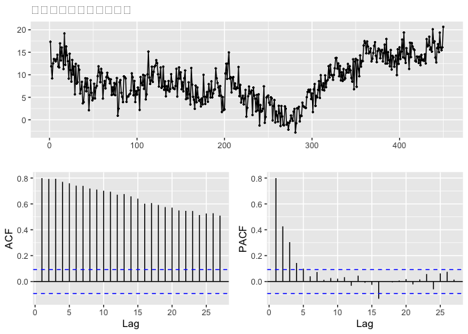
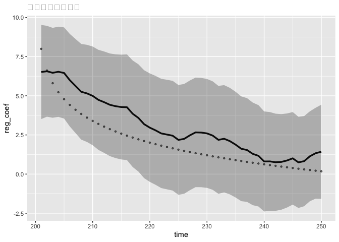

## 10-1.この章で使うパッケージ

``` r
library(KFAS)
library(forecast)
library(ggplot2)
library(ggfortify)
```

## 10-2.シミュレーションデータの作成

-   状態を作成する。

    -   true_reg_coefとして、真の回帰係数を時変係数として設定。
    -   「-log(1:50)」としてあるので、50期間において単調減少
    -   201\~250時点において広告有りという設定
    -   ランダムウォークする水準値"mu"に広告の影響を加えたものが、最終的な状態"x"

``` r
# シミュレーションデータの作成
n_sample <- 450

# 乱数の種
set.seed(10)

# 時間によって変化する広告の効果
true_reg_coef <- -log(1:50) * 2 + 8

# ランダムウォークする水準値
mu <- cumsum(rnorm(n = n_sample, sd = 0.5)) + 15

# 水準値＋広告効果として状態を作る
x <- mu + c(rep(0, 200), true_reg_coef, rep(0, 200))
```

-   観測誤差を加える。

``` r
# 観測誤差を作成
obs_error <- rnorm(n = n_sample, sd = 2)

# 広告効果が入った売り上げデータ
sales_ad <- x + obs_error
```

-   説明変数を作成

``` r
# 説明変数としての広告フラグ（1なら広告有り）
ad_flg <- numeric(n_sample)
ad_flg[201:250] <- 1
```

``` r
# 図示
ggtsdisplay(ts(sales_ad), main = "シミュレーションデータ")
```



-   200\~250の期間に着目しても効果があるのかどうかがわからない。
-   これを状態空間モデルでモデリングし、評価していく。

## 10-3.KFASによる時変係数モデル

-   時変係数モデルでモデリング

``` r
# Step1 モデルの構造を決める
build_reg <- SSModel(
  H = NA,
  sales_ad ~
    SSMtrend(degree = 1, Q =NA)+
    SSMregression( ~ ad_flg, Q = NA)  # 回帰項※
)

# Step2 パラメタ推定
fit_reg <- fitSSM(build_reg, inits = c(1,1,1))

# Step3,4 フィルタリング、スムージング
result_red <- KFS(
  fit_reg$model,
  filtering = c("state", "mean"),
  smoothing = c("state", "mean")
)
```

-   時変係数モデルを作成するには、"ローカルレベルモデル"＋"回帰項"（※）

## 10-4.変化する広告効果の図示

-   回帰係数の時間変化を図示（信頼区間付き）

``` r
# 予測
interval_coef <- predict(fit_reg$model,
                         states = "regression",  # 回帰係数の取得フラグ
                         interval = "confidence",
                         level = 0.95
                         )

# データの整形
coef_df <- cbind(
  data.frame(time = 201:250, reg_coef = true_reg_coef),
  as.data.frame(interval_coef[201:250, ])
)
  
# 図示
ggplot(data = coef_df, aes(x = time, y = reg_coef)) +
  labs(title = "広告の効果の変化") +
  geom_point(alpha = 0.6, size = 0.9) +
  geom_line(aes(y = fit), size = 1.2) +
  geom_ribbon(aes(ymin = lwr, ymax = upr), alpha = 0.3)
```

    ## Warning: Using `size` aesthetic for lines was deprecated in ggplot2 3.4.0.
    ## ℹ Please use `linewidth` instead.



-   点線が真の回帰係数。実線が推定された回帰係数。グレーが95％信頼区間。
-   時変係数モデルは、広告を含め、イベントの効果を評価するのに有効。
-   元々、周期性を含んだデータでモデリングすると紛れてしまい、正しい周期性を見誤る原因にもなる。 (実際は、広告効果による変化かもしれないのに。)
-   これを補正するために外生変数を入れることもある。
