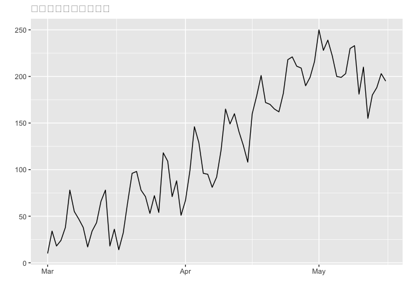
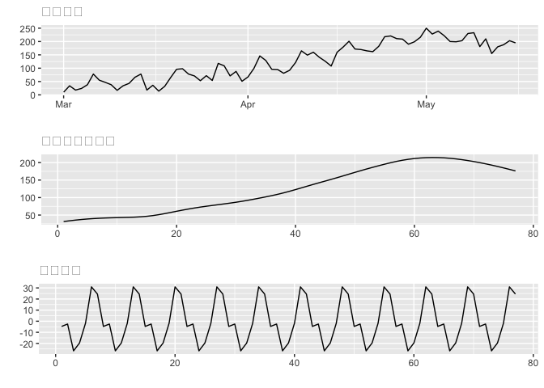
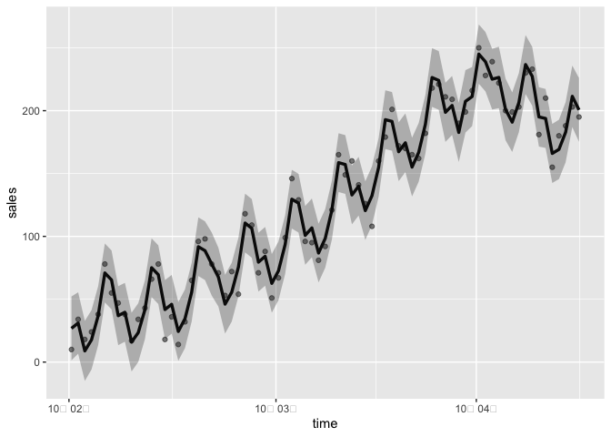
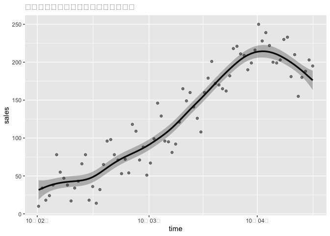

## 11-1.この章で使うパッケージ

``` r
library(KFAS)
library(xts)
library(ggplot2)
library(ggfortify)
library(gridExtra)

# 祝日判定用の関数
source("https://raw.githubusercontent.com/logics-of-blue/website/master/010_forecast/20190714_R%E8%A8%80%E8%AA%9E%E3%81%AB%E3%81%8A%E3%81%91%E3%82%8B%E6%97%A5%E6%9C%AC%E3%81%AE%E7%A5%9D%E6%97%A5%E5%88%A4%E5%AE%9A/jholiday.R", encoding="utf-8")
```

## 11-2.データの読み込みと整形

-   ファイルからデータを読み込み、分析。対象は架空の売り上げデータ（2010-03-01\~）

``` r
file_data <- read.csv("./data/5-11-sales_data.csv")

head(file_data, n=3)
```

    ##         date sales
    ## 1 2010-03-01    10
    ## 2 2010-03-02    34
    ## 3 2010-03-03    18

-   xts型に変換

``` r
sales <- as.xts(read.zoo(file_data))
head(sales, n=3)
```

    ##            [,1]
    ## 2010-03-01   10
    ## 2010-03-02   34
    ## 2010-03-03   18

``` r
# 図示
autoplot(sales, main = "架空の売り上げデータ")
```



-   １週間周期性とトレンドの変化が見られる。

## 11-3.祝日の取り扱い

-   日付データを扱う場合には、日本固有の暦の影響を加味する必要がある。
-   xts型だと日付とデータに切り分けが簡単。
-   祝日判定は、Nipponパッケージがなくなったため、専用の関数で対応。

``` r
# 日付の抽出
dates <- index(sales)
head(dates, n=5)
```

    ## [1] "2010-03-01" "2010-03-02" "2010-03-03" "2010-03-04" "2010-03-05"

``` r
# 祝日判定
head(is.jholiday(dates))
```

    ## [1] FALSE FALSE FALSE FALSE FALSE FALSE

``` r
# 祝日のみ抽出
dates[is.jholiday(dates)]
```

    ## [1] "2010-03-21" "2010-03-22" "2010-04-29" "2010-05-03" "2010-05-04"
    ## [6] "2010-05-05"

-   “2010-03-21”,“2010-03-22”と連続で祝日になっている。
-   原因を調べる。

``` r
weekdays(dates[is.jholiday(dates)], T)
```

    ## [1] "Sun" "Mon" "Thu" "Mon" "Tue" "Wed"

-   “2010-03-21”が日曜日のため、“2010-03-22”がそれの振替休日ということがわかる。
-   そこで、日曜日以外の祝日を対象とする。

``` r
holiday_date <- 
  dates[is.jholiday(dates) & (weekdays(dates, T) != "Sun")]
holiday_date
```

    ## [1] "2010-03-22" "2010-04-29" "2010-05-03" "2010-05-04" "2010-05-05"

-   ここで悩ましいのは土曜日が祝日の時。土曜出勤等があると、祝日でも効果があるように捉えられる。
-   最後に祝日フラグを作成する。

``` r
holiday_flg <- as.numeric(dates %in% holiday_date)
holiday_flg
```

    ##  [1] 0 0 0 0 0 0 0 0 0 0 0 0 0 0 0 0 0 0 0 0 0 1 0 0 0 0 0 0 0 0 0 0 0 0 0 0 0 0
    ## [39] 0 0 0 0 0 0 0 0 0 0 0 0 0 0 0 0 0 0 0 0 0 1 0 0 0 1 1 1 0 0 0 0 0 0 0 0 0 0
    ## [77] 0

-   %in%：holiday_dateにTRUEがあればTRUE、それ以外はFALSEを返す演算子
-   as.numericでそれを1,0に変換している

## 11-4.KFASによる基本構造時系列モデル

-   状態空間モデルを推定する。

``` r
# Step1 モデルの構造を決める
build_cycle <- SSModel(
  H = NA,
  as.numeric(sales) ~
    SSMtrend(degree = 2, c(list(NA), list(NA))) +
    SSMseasonal(period = 7, sea.type = "dummy", Q = NA) +
    holiday_flg
)

# Step2 パラメタ推定
fit_cycle <- fitSSM(build_cycle, inits = c(1,1,1,1))

# Step3,4 フィルタリング・スムージング
result_cycle <- KFS(
  fit_cycle$model,
  filtering = c("state", "mean"),
  smoothing = c("state", "mean")
)
```

-   周期成分はSSMseasonalで指定。’sea.type=“dummy”’としたので、ダミー変数を使ったもの。
-   祝日フラグは外生変数としてモデルに組み込んでいる。（時間には影響受けない）

## 11-5.推定結果の確認

-   元データを”トレンド+水準”の要素と、“周期成分”の要素に分けて図示。

``` r
p_data  <- autoplot(sales, main = "元データ")

p_trend <- autoplot(
  result_cycle$alphahat[, "level"],
  main = "トレンド＋水準"
)

p_cycle <- autoplot(
  result_cycle$alphahat[, "sea_dummy1"],
  main = "周期成分"
)

grid.arrange(p_data, p_trend, p_cycle)
```



## 11-6.推定結果の図示

-   平滑化状態とその予測区間を図示

``` r
interval_cycle <- predict(
  fit_cycle$model,
  interval = "prediction",
  level = 0.95
)

# データ整形
df <- cbind(
  data.frame(sales = as.numeric(sales),
             time  = as.POSIXct(index(sales))),
  as.data.frame(interval_cycle)
)

# 図示
ggplot(data = df, aes(x = time, y = sales)) +
  labs(titel = "周期成分のある状態空間モデル") +
  geom_point(alpha = 0.5) +
  geom_line(aes(y = fit), size = 1.2) +
  geom_ribbon(aes(ymin = lwr, ymax = upr), alpha = 0.3) +
  scale_x_datetime(date_labels = "%y年 %m月")
```

    ## Warning: Using `size` aesthetic for lines was deprecated in ggplot2 3.4.0.
    ## ℹ Please use `linewidth` instead.



-   日付インデックスとして、as.POSIXctとしたものを用いる。
-   こうすることで、ggplotでの描画時、scale_x\_datetimeという指定で横軸を任意の日付形式に変更が可能

## 11-7.周期成分を取り除く

``` r
# 予測区間と平滑化状態
interval_level <- predict(
  fit_cycle$model,
  interval = "confidence",
  level = 0.95,
  states = "level"
)

# データ整形
df_level <- cbind(
  data.frame(sales = as.numeric(sales),
             time  = as.POSIXct(index(sales))),
  as.data.frame(interval_level)
)

# 図示
ggplot(data = df_level, aes(x=time, y=sales)) +
  labs(title = "周期成分を取り除いた水準値のグラフ") +
  geom_point(alpha = 0.5) +
  geom_line(aes(y=fit), size=1.2) +
  geom_ribbon(aes(ymin=lwr, ymax=upr), alpha = 0.3) +
  scale_x_datetime(date_labels = "%y年 %m月")
```



## 11-8.季節調整のメリット

-   例えば、1年単位での周期成分があったとして、短い期間で見たら、トレンドなのか、周期変動なのか
    見分けにくいことがある。
-   そのような時に、周期成分を取り除いたグラフを用いることで、データの正確な傾向が掴める。
-   周期成分については、複数のものをモデルに組み込むことができる。
-   また、周期成分を用いることで、見せかけの回帰を防ぐことも可能
-   他の外生変数と相関しているように見えて、実は同じ周期成分を持っているということがある。
-   これは季節調整可能なモデルで解決できる内容。
