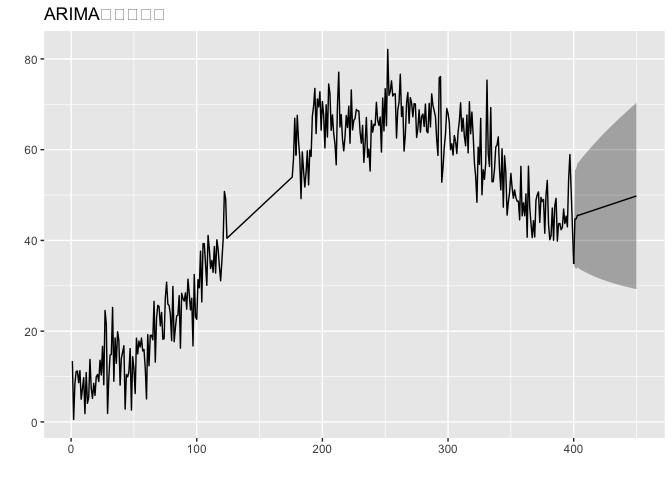

## 9-1.この章で使うパッケージ

``` r
library(KFAS)
library(forecast)
library(ggplot2)
library(ggfortify)
library(gridExtra)
```

## 9-2.トレンドと観測値の関係

-   トレンド：累積和を取ることで、データのおおよその形状が表現できる。

``` r
# 450時点のデータ、毎時点0.2ずつ増えていくという上昇トレンド
n_sample <- 450
t0 <- 0.2  # 変化しないトレンド

# データの観測値は、トレンドの累積和として表現
constant_trend <- cumsum(rep(t0, n_sample))
```

``` r
# トレンドが変化する
t1 <- 0.2
t2 <- 0.4
t3 <- 0.0
t4 <- -0.2

# それぞれの時点ごとにトレンドが変わっている
trend <- c(rep(t1,100), rep(t2,100), rep(t3,100), rep(t4,150))

# 累積和で観測値を取得
change_trend <- cumsum(trend)
```

-   それぞれを図示して、イメージを作る。

``` r
p1 <- autoplot(ts(constant_trend),
               xlab = "Time",
               main = "変化しないトレンド(0.2)")

p2 <- autoplot(ts(change_trend),
               xlab = "Time",
               main = "変化するトレンド(0.2->0.4->0.0->-0.2)")

grid.arrange(p1,p2)
```


## 9-3.シミュレーションデータの作成

-   過程誤差は、平均0、分散1の正規分布に従う

``` r
# 水準の過程誤差を作る
set.seed(12)

system_noise <- rnorm(n = n_sample)

# 真の水準値 = 前期の水準値 + トレンド + 過程誤差
alpha_true <- numeric(n_sample + 1)

for(i in 1:n_sample){
  alpha_true[i+1] <- alpha_true[i] + trend[i] + system_noise[i]
}
```

-   観測誤差は、平均0、分散25(標準偏差5)の正規分布に従う

``` r
# 観測誤差を作る
obs_noise <- rnorm(n = n_sample, sd = 5)

# トレンドが変化する売り上げデータ
sales <- alpha_true[-1] + obs_noise + 11  # 11は売り上げが負にならないようにする補正値

# 結果を図示
autoplot(ts(sales), main = "架空の売り上げデータ")
```


-   trainとtestにデータを分ける。

``` r
sales_train <- sales[1:400]
sales_test  <- sales[401:450]

# 途中の50期間は欠損
sales_train[125:175] <- NA
```

## 9-4.KFASによるローカル線形トレンドモデル

``` r
# Step1 モデルの構造を決める
build_trend <- SSModel(
  H = NA,
  sales_train ~ SSMtrend(degree = 2, Q = c(list(NA), list(NA)))  # ローカル線形トレンドモデル
)

# Step2 パラメタ推定
fit_trend <- fitSSM(build_trend, inits = c(1,1,1))

# Step3,4 フィルタリング、スムージング
result_trend <- KFS(
  fit_trend$model,
  filtering = c("state", "mean"),
  smoothing = c("state", "mean")
)
```

``` r
# 結果の確認

## 観測誤差の分散
fit_trend$model$H
```

    ## , , 1
    ## 
    ##          [,1]
    ## [1,] 23.63745

``` r
## 過程誤差の分散
fit_trend$model$Q
```

    ## , , 1
    ## 
    ##           [,1]         [,2]
    ## [1,] 0.8833319 0.0000000000
    ## [2,] 0.0000000 0.0004648067

-   過程誤差において、「水準の変動」が0.8833319、「トレンドの変動」が0.0004648067

## 9-5.補足：モデルの行列表現

-   割愛

## 9-6.トレンドの図示

-   推定された平滑化状態を見ると、ローカルレベルとは異なり、2列で表現されている。

``` r
head(result_trend$alphahat, n = 3)
```

    ## Time Series:
    ## Start = 1 
    ## End = 3 
    ## Frequency = 1 
    ##      level     slope
    ## 1 7.592715 0.1979556
    ## 2 7.573414 0.1980699
    ## 3 7.817400 0.1981601

-   levelは水準( *μ*<sub>*t*</sub> )、slopeはトレンド成分(
    *δ*<sub>*t*</sub> )となる。
-   平滑化されたトレンド成分と真のトレンドを合わせて図示。

``` r
# データの整形
trend_df <- data.frame(
  time = 1:length(sales_train),
  true_trend = trend[1:length(sales_train)],
  estimate_trend = result_trend$alphahat[, "slope"]
)

# 図示
ggplot(data = trend_df, aes(x=time, y=true_trend)) +
  labs(title = 'トレンドの変化') +
  geom_line(aes(y = true_trend), size = 1.2, linetype="dashed") +
  geom_line(aes(y = estimate_trend), size = 1.2)
```

    ## Warning: Using `size` aesthetic for lines was deprecated in ggplot2 3.4.0.
    ## ℹ Please use `linewidth` instead.


-   点線：真のトレンド / 実践：推定されたトレンド

## 9-7.補間と予測

``` r
# 平滑化状態と予測区間
interval_trend <- predict(
  fit_trend$model,
  interval = "prediction",
  level = 0.95
)

# 将来予測の結果と予測区間
forecast_trend <- predict(
  fit_trend$model,
  interval = "prediction",
  level = 0.95,
  n.ahead = 50
)

# 過去の状態と予測結果をまとめた
estimate_all <- rbind(interval_trend, forecast_trend)
```

## 9-8.ローカル線形トレンドモデルによる予測の考え方

-   データが得られている最新時点の水準値とトレンドを取得

``` r
last_level <- tail(result_trend$a[, "level"], n = 1)
last_trend <- tail(result_trend$a[, "slope"], n = 1)

last_level  # 水準
```

    ## Time Series:
    ## Start = 401 
    ## End = 401 
    ## Frequency = 1 
    ## [1] 44.60478

``` r
last_trend  # トレンド
```

    ## Time Series:
    ## Start = 401 
    ## End = 401 
    ## Frequency = 1 
    ## [1] -0.1395292

-   最後の水準値last_levelから、最後のトレンドlast_trendが毎時点足し合わされることによって、予測値が求められる。

``` r
fore <- cumsum(c(last_level, rep(last_trend, 49)))

# ループを使って計算
fore2 <- numeric(50)
fore2[1] <- last_level
for(i in 2:50){
  fore2[i] <- fore2[i-1] + last_trend
}
```

## 9-9.補間と予測結果の図示

``` r
# データの整形
df <- cbind(
  data.frame(sales = sales, time = 1:n_sample),
  as.data.frame(estimate_all)
)

# 図示
ggplot(data = df, aes(x=time, y=sales)) +
  labs(title = "トレンドが変わる売り上げの予測") +
  geom_point(alpha = 0.6, size = 0.9) +
  geom_line(aes(y = fit), size = 1.2) +
  geom_ribbon(aes(ymin = lwr, ymax = upr), alpha = 0.3)
```


## 9-10.ARIMAによる予測結果との比較

``` r
# モデルの構築
model_arima <- auto.arima(sales_train)

# 予測
forecast_arima <- forecast(model_arima, h = 50, level = 0.95)

# 予測結果の図示
autoplot(forecast_arima, 
         main = "ARIMAによる予測", 
         predict.colour = 1,
         shadecols = "gray")
```



-   状態空間モデルとARIMAモデルでの予測精度比較

``` r
# ローカル線形トレンドモデル
accuracy(forecast_trend[, "fit"], sales_test)["Test set", "RMSE"]
```

    ## [1] 7.47772

``` r
# ARIMA
accuracy(forecast_arima, sales_test)["Test set", "RMSE"]
```

    ## [1] 13.08098
