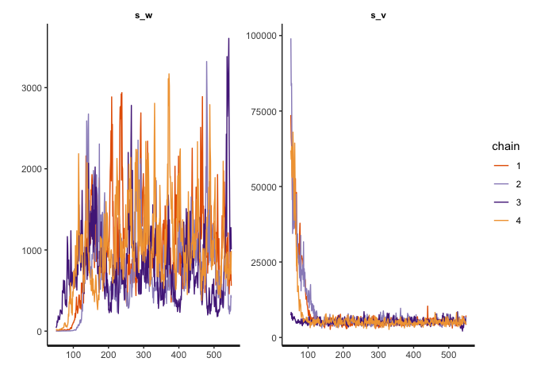
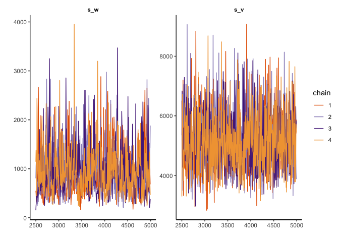
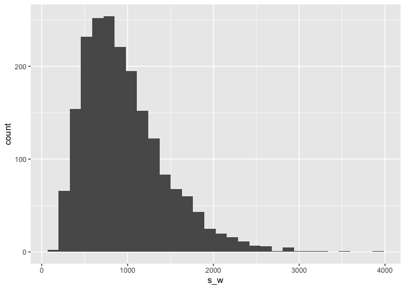
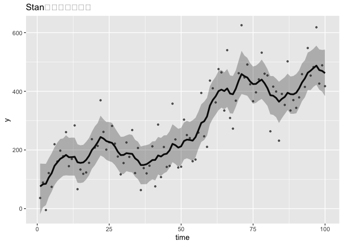

## 3-1.Stanのインストール

-   下記コマンドでインストール。

-   install.packages(‘rstan’,repos=‘<https://cloud.r-project.org/>’,
    dependencies=TRUE)

## 3-2.この章で使うパッケージ

``` r
library(rstan)
library(ggplot2)
```

-   Stanの計算速度を速くする設定。

``` r
rstan_options(auto_write = TRUE)
options(mc.cores = parallel::detectCores())
```

## 3-3.シミュレーションデータの作成

-   今回はローカルレベルモデルに従うシミュレーションデータを生成。

``` r
# data
n_sample <- 100                # サンプルサイズ
y        <- numeric(n_sample)  # 観測値

# parameters
mu_zero <- 100                 # 状態の初期値
mu      <- numeric(n_sample)   # 状態の推定値
s_w     <- 1000                # 過程誤差の分散
s_v     <- 5000                # 観測誤差の分散
```

-   分析対象となるデータをシミュレーション作成。（このコードは非効率。理由があるらしい。）

``` r
set.seed(1)

# 状態の初期値から最初の時点の状態が得られる
mu[1] <- rnorm(n=1, mean = mu_zero, sd = sqrt(s_w))

# 状態方程式に従い、状態が遷移する。
for(i in 2:n_sample) {
  mu[i] <- rnorm(n = 1, mean = mu[i-1], sd = sqrt(s_w))
}

# 観測方程式に従い、観測値が得られる
for(i in 1:n_sample) {
  y[i] <- rnorm(n = 1, mean = mu[i], sd = sqrt(s_v))
}
```

-   1時点目の状態muは、状態の初期値mu_zeroに過程誤差が加わったものとして得られる。
-   2時点目以降は、前時点の状態に過程誤差が加わったもの。
-   観測値は同じ時点における状態に、観測誤差が加わったもの。

## 3-4.Stanファイルの記述

-   Rstudioのメニューから「File -\> New File -\>
    TextFile」の順に選択。新しいファイルを作成。

-   ファイル名「6-3-local-level-model.stan」

    -   data{ // 使用されるデータを記述}
    -   parameters{ // 推定される状態・パラメタの一覧を記述}
    -   model{ // データ生成過程を記述}

## 3-5.dataブロックの指定

-   dataブロックには、「データを変えた時に変更される変数」を指定。

1.  変数の「型」をあらかじめ宣言する。

    1.1 int：整数型 1.2 real：実数型

         1.2.1 y[n_sample] ：長さが n_sample である配列。int型も配列可能。

2.  行末にはセミコロンをつける。

3.  コメントアウトは’//’

## 3-6.parametersブロックの指定

-   parametersブロックには、推定される状態やパラメタが格納される変数を定義。
-   \<lower=0\>：最小値を0とする。分散が0未満ということはあり得ないため、指定。

## 3-7.modelブロックの指定

-   modelブロックには、データ生成過程を記述。
-   “=”ではなく、“\~”を用いる。どの確率分布に従ってデータが生成されているかということ。
-   特に指定をしない場合は、事前分布として無情報事前分布が使用される。

## 3-8.データ生成過程(GDP)とStanの関係

-   シミュレーションデータについては、Stanのコードに寄せて記述してあるため、
    ほとんど一緒。

-   Stanは確率的プログラミング言語の一種らしい。

-   Stanによって、「どの変数が、どのような確率分布に従って生成されているか」を
    そのまま記述して、モデルを構築できる。

-   データを確率変数とみなして、確率変数の従う確率分布を推定することこそが、
    未来のデータを推測するという、推測統計学の枠組み。

## 3-9.Stanによるローカルレベルモデルの推定

``` r
# データの準備
data_sim <- list(y = y, n_sample = n_sample)

# モデルの推定
fit_stan_1 <- stan(
  file = "6-3-local-level-model.stan",
  data = data_sim,
  iter = 550,
  warmup = 50,
  thin = 1,
  chains = 4,
  seed = 1
)
```

    ## hash mismatch so recompiling; make sure Stan code ends with a blank line

    ## Trying to compile a simple C file

    ## Running /opt/homebrew/Cellar/r/4.2.2/lib/R/bin/R CMD SHLIB foo.c
    ## clang -I"/opt/homebrew/Cellar/r/4.2.2/lib/R/include" -DNDEBUG   -I"/opt/homebrew/Cellar/r/4.2.2/lib/R/library/Rcpp/include/"  -I"/opt/homebrew/Cellar/r/4.2.2/lib/R/library/RcppEigen/include/"  -I"/opt/homebrew/Cellar/r/4.2.2/lib/R/library/RcppEigen/include/unsupported"  -I"/opt/homebrew/Cellar/r/4.2.2/lib/R/library/BH/include" -I"/opt/homebrew/Cellar/r/4.2.2/lib/R/library/StanHeaders/include/src/"  -I"/opt/homebrew/Cellar/r/4.2.2/lib/R/library/StanHeaders/include/"  -I"/opt/homebrew/Cellar/r/4.2.2/lib/R/library/RcppParallel/include/"  -I"/opt/homebrew/Cellar/r/4.2.2/lib/R/library/rstan/include" -DEIGEN_NO_DEBUG  -DBOOST_DISABLE_ASSERTS  -DBOOST_PENDING_INTEGER_LOG2_HPP  -DSTAN_THREADS  -DBOOST_NO_AUTO_PTR  -include '/opt/homebrew/Cellar/r/4.2.2/lib/R/library/StanHeaders/include/stan/math/prim/mat/fun/Eigen.hpp'  -D_REENTRANT -DRCPP_PARALLEL_USE_TBB=1   -I/opt/homebrew/opt/gettext/include -I/opt/homebrew/opt/readline/include -I/opt/homebrew/opt/xz/include -I/opt/homebrew/include   -fPIC  -Wno-implicit-function-declaration  -c foo.c -o foo.o
    ## In file included from <built-in>:1:
    ## In file included from /opt/homebrew/Cellar/r/4.2.2/lib/R/library/StanHeaders/include/stan/math/prim/mat/fun/Eigen.hpp:13:
    ## In file included from /opt/homebrew/Cellar/r/4.2.2/lib/R/library/RcppEigen/include/Eigen/Dense:1:
    ## In file included from /opt/homebrew/Cellar/r/4.2.2/lib/R/library/RcppEigen/include/Eigen/Core:88:
    ## /opt/homebrew/Cellar/r/4.2.2/lib/R/library/RcppEigen/include/Eigen/src/Core/util/Macros.h:628:1: error: unknown type name 'namespace'
    ## namespace Eigen {
    ## ^
    ## /opt/homebrew/Cellar/r/4.2.2/lib/R/library/RcppEigen/include/Eigen/src/Core/util/Macros.h:628:16: error: expected ';' after top level declarator
    ## namespace Eigen {
    ##                ^
    ##                ;
    ## In file included from <built-in>:1:
    ## In file included from /opt/homebrew/Cellar/r/4.2.2/lib/R/library/StanHeaders/include/stan/math/prim/mat/fun/Eigen.hpp:13:
    ## In file included from /opt/homebrew/Cellar/r/4.2.2/lib/R/library/RcppEigen/include/Eigen/Dense:1:
    ## /opt/homebrew/Cellar/r/4.2.2/lib/R/library/RcppEigen/include/Eigen/Core:96:10: fatal error: 'complex' file not found
    ## #include <complex>
    ##          ^~~~~~~~~
    ## 3 errors generated.
    ## make: *** [foo.o] Error 1

-   この方法だと、あまりうまくはいかないらしい。

-   dataブロックに格納する変数をlist形式でStan関数に渡す。

-   Stan関数の引数の説明は以下の通り。

    -   file：Stanファイルのファイル名
    -   data：list形式でまとめられれたstanとdataブロックに格納する変数
    -   iter：繰り返し数。乱数を生成する回数の指定。
    -   warmup：生成された乱数を切り捨てる期間。
        乱数を生成する際、乱数の初期値にある程度依存している。その依存性を下げるために、
        最初からどれくらいの長さ分切り捨てるのかを指定する。
    -   thin：間引き数
        “thin=2”なら、2個に1個間引きをする。“thin=5”だと、5個のうち4個が間引きされる。
        行う理由としては、1ステップ前の乱数と似てしまう可能性があり、似たような乱数が採用されてしまうため。
    -   chains：「iter回の乱数生成」を行う回数
        得られた乱数の値を信用しても良いのかを確認するために、「iter回の乱数生成」を何度も繰り返し、
        実行。毎回異なる乱数が生成された時、EAP推定量が100になったり、1億になったりするのは問題。
        これが問題なければ収束したということになり、chainごとに混じり合うようにらんんすうが生成されて
        いれば、収束したとみなす。定量的に捉えるなら、*R̂*という指標。“1.1”未満かどうかが判断基準で、
        それ未満ならパラメタが収束したと見做せる。
    -   seed：いつものやつ。ほとんど必須の引数。

-   Stanは状態空間モデルを推定する上では、高速なソフトウェアである。

-   C++で書かれていること、HMC法を用いていることが理由として挙げられる。

-   \[rstan_options(auto_write=TRUE)\]：再コンパイルしないように、コンパイル後のStanプログラムを保存しておく。

-   \[options(mc.cores = parallel::detectCores())\]：並列化演算の設定。

## 3-10.結果の出力と収束の判定

-   得られた乱数の要約を見るには、以下のコード。

``` r
options(max.print = 100000)
print(fit_stan_1)
```

    ## Inference for Stan model: 6-3-local-level-model.
    ## 4 chains, each with iter=550; warmup=50; thin=1; 
    ## post-warmup draws per chain=500, total post-warmup draws=2000.
    ## 
    ##            mean se_mean      sd    2.5%     25%     50%     75%    97.5% n_eff
    ## mu_zero   79.58    5.58   57.87  -32.58   39.62   79.30  117.81   201.23   108
    ## mu[1]     80.03    5.29   49.14   -7.86   45.94   79.02  110.25   191.59    86
    ## mu[2]     86.12    4.62   43.32    7.96   56.78   84.07  111.80   185.46    88
    ## mu[3]     90.86    4.29   41.12   15.75   64.65   89.02  113.78   184.25    92
    ## mu[4]    109.31    3.26   37.44   37.60   84.85  108.57  131.41   192.55   132
    ## mu[5]    125.02    2.51   35.26   56.99  102.20  125.07  147.33   200.99   198
    ## mu[6]    148.52    2.00   34.91   81.15  125.93  147.87  170.33   221.79   303
    ## mu[7]    159.05    2.05   35.07   89.40  136.45  158.81  180.75   231.04   293
    ## mu[8]    169.75    2.21   35.15   98.87  148.31  170.31  193.12   238.13   254
    ## mu[9]    176.22    2.34   35.37  103.77  154.43  177.11  200.47   242.78   228
    ## mu[10]   182.38    2.64   36.67  105.09  160.88  183.05  206.72   250.17   194
    ## mu[11]   175.24    2.20   35.09  101.29  154.41  176.64  198.54   241.22   255
    ## mu[12]   175.12    2.19   35.33  101.50  153.13  175.44  199.79   241.07   259
    ## mu[13]   175.94    2.24   35.92   99.18  154.70  176.85  199.53   242.72   258
    ## mu[14]   158.31    2.09   35.67   81.24  136.36  160.46  182.27   222.38   292
    ## mu[15]   156.81    2.06   35.82   80.07  134.08  158.60  181.72   220.05   302
    ## mu[16]   158.84    2.12   36.26   83.36  135.03  160.52  182.91   228.48   293
    ## mu[17]   165.99    2.06   35.97   87.82  143.71  166.30  190.81   231.05   304
    ## mu[18]   179.84    2.05   34.37  106.66  159.43  181.57  203.24   242.99   282
    ## mu[19]   197.55    2.43   36.63  117.24  175.46  199.20  221.19   263.74   227
    ## mu[20]   209.11    2.88   37.62  123.62  188.26  211.17  232.65   276.68   171
    ## mu[21]   221.30    3.41   40.44  121.80  199.58  223.76  247.26   290.12   141
    ## mu[22]   236.04    4.51   44.25  122.46  211.66  238.20  263.77   309.87    96
    ## mu[23]   230.95    4.19   42.46  121.86  208.69  232.20  257.19   308.86   103
    ## mu[24]   223.11    3.59   40.53  125.57  200.80  225.30  249.70   294.86   128
    ## mu[25]   220.45    3.38   39.81  124.87  198.81  222.19  245.24   289.84   138
    ## mu[26]   217.94    3.07   38.77  126.69  197.38  219.82  242.51   288.49   159
    ## mu[27]   206.18    2.56   38.05  121.73  183.86  208.09  231.53   277.00   221
    ## mu[28]   192.38    2.25   37.36  109.87  170.41  194.29  218.24   258.58   276
    ## mu[29]   181.50    2.16   37.04  102.54  159.26  182.69  205.99   251.14   295
    ## mu[30]   181.29    2.08   36.51  104.73  159.14  182.17  205.96   248.74   307
    ## mu[31]   187.06    2.07   35.47  114.29  165.81  186.48  210.89   253.61   294
    ## mu[32]   185.70    2.10   36.19  109.38  161.90  187.62  210.81   250.68   298
    ## mu[33]   185.66    2.07   37.77  107.40  162.64  186.17  210.55   257.93   332
    ## mu[34]   171.77    2.14   36.82   99.21  147.82  171.83  195.89   242.73   296
    ## mu[35]   165.73    2.30   36.44   95.88  142.66  165.56  187.91   238.64   251
    ## mu[36]   152.18    2.75   37.30   79.86  127.04  151.70  176.25   227.77   184
    ## mu[37]   152.32    2.71   36.34   82.54  128.26  151.22  175.61   224.59   181
    ## mu[38]   153.81    2.57   36.19   83.21  130.31  154.06  176.43   224.71   199
    ## mu[39]   160.62    2.33   35.67   89.93  137.26  159.82  183.55   229.50   234
    ## mu[40]   168.37    2.24   35.79   94.48  145.50  168.49  191.74   237.46   255
    ## mu[41]   167.27    2.18   34.87   97.57  144.33  167.77  189.95   234.14   256
    ## mu[42]   181.58    1.99   33.60  112.94  160.62  182.42  204.20   245.64   284
    ## mu[43]   176.31    2.17   34.12  103.41  155.11  177.02  199.01   240.60   248
    ## mu[44]   183.51    2.07   33.28  115.19  162.80  183.64  205.08   246.79   257
    ## mu[45]   186.47    2.16   33.93  113.70  166.70  187.22  208.90   250.55   247
    ## mu[46]   196.46    2.10   34.60  118.36  175.88  198.09  219.57   258.82   270
    ## mu[47]   216.73    2.37   37.05  131.48  195.95  219.23  239.89   283.37   244
    ## mu[48]   212.54    2.28   35.77  136.32  190.88  214.69  235.79   278.30   247
    ## mu[49]   204.65    2.22   36.44  121.01  182.43  207.36  228.70   269.88   269
    ## mu[50]   209.30    2.27   36.28  125.59  187.79  211.58  233.34   275.23   255
    ## mu[51]   226.34    2.48   37.24  143.45  204.83  228.54  251.03   289.73   226
    ## mu[52]   229.74    2.62   37.47  143.15  208.87  232.69  254.80   292.67   205
    ## mu[53]   231.07    2.66   38.07  142.55  211.14  233.17  255.49   295.44   205
    ## mu[54]   229.93    2.84   39.45  130.89  209.14  232.69  256.45   297.04   194
    ## mu[55]   240.40    3.05   40.35  145.53  219.78  243.86  267.16   306.38   175
    ## mu[56]   262.96    3.59   42.20  161.96  242.87  267.42  289.42   332.97   138
    ## mu[57]   286.78    4.72   44.58  164.00  268.23  291.44  313.15   356.87    89
    ## mu[58]   291.61    4.87   44.80  164.79  274.89  297.61  318.46   357.95    85
    ## mu[59]   306.38    5.45   48.47  167.36  287.63  312.19  334.68   378.68    79
    ## mu[60]   338.82    7.04   54.21  166.53  321.69  346.83  370.00   412.57    59
    ## mu[61]   357.21    7.95   58.01  170.46  340.38  365.51  391.38   433.14    53
    ## mu[62]   369.64    8.50   60.26  170.39  353.55  379.06  403.86   449.09    50
    ## mu[63]   386.30    9.32   64.66  170.04  369.08  396.32  421.89   469.59    48
    ## mu[64]   390.28    9.31   64.40  174.33  376.00  401.62  424.77   473.25    48
    ## mu[65]   385.62    8.84   62.93  172.36  370.00  394.95  419.83   467.34    51
    ## mu[66]   393.34    9.17   64.72  174.36  377.33  403.46  428.47   474.74    50
    ## mu[67]   377.01    8.28   60.58  174.02  361.92  387.89  410.22   450.38    53
    ## mu[68]   375.86    8.15   60.26  175.85  359.92  387.02  410.26   448.22    55
    ## mu[69]   393.47    8.84   63.75  178.37  378.40  404.34  428.38   472.49    52
    ## mu[70]   419.18   10.13   69.42  181.27  405.62  432.70  455.76   500.71    47
    ## mu[71]   440.36   11.26   75.59  182.18  426.64  453.56  479.13   532.60    45
    ## mu[72]   435.13   10.78   73.23  181.41  421.72  449.52  473.23   517.43    46
    ## mu[73]   431.44   10.46   71.74  181.57  419.80  444.73  468.63   512.53    47
    ## mu[74]   420.81    9.77   68.57  182.34  408.85  433.25  456.21   502.22    49
    ## mu[75]   412.00    9.24   65.93  183.12  400.45  424.30  446.11   485.91    51
    ## mu[76]   411.35    9.10   65.72  185.78  398.40  423.10  445.03   489.05    52
    ## mu[77]   416.83    9.54   67.24  184.10  404.55  428.74  451.54   499.15    50
    ## mu[78]   422.65    9.96   69.01  186.80  409.96  434.68  457.99   507.30    48
    ## mu[79]   411.85    9.39   66.11  184.77  398.40  423.78  446.59   490.30    50
    ## mu[80]   397.15    8.52   62.51  181.45  381.84  408.53  429.70   475.47    54
    ## mu[81]   374.70    7.43   57.65  179.44  359.55  384.88  406.24   449.60    60
    ## mu[82]   372.82    7.29   57.48  185.17  355.50  381.24  405.87   446.96    62
    ## mu[83]   366.53    7.09   55.97  183.58  349.39  375.55  399.45   438.33    62
    ## mu[84]   354.78    6.57   54.35  189.22  336.05  363.16  387.65   428.45    68
    ## mu[85]   365.78    7.05   55.53  189.22  348.54  375.30  397.61   437.11    62
    ## mu[86]   372.09    7.23   56.40  189.28  357.16  380.62  402.68   443.52    61
    ## mu[87]   384.89    7.86   58.71  189.90  369.59  394.65  415.92   458.42    56
    ## mu[88]   376.75    7.48   57.66  188.54  360.86  386.05  408.47   452.81    59
    ## mu[89]   378.51    7.55   58.52  187.98  362.26  388.16  411.49   454.39    60
    ## mu[90]   384.36    7.76   59.12  192.88  368.87  394.08  415.49   459.58    58
    ## mu[91]   397.53    8.23   61.25  193.44  382.97  408.72  429.62   473.94    55
    ## mu[92]   416.05    9.15   65.94  191.73  401.89  427.85  451.85   494.07    52
    ## mu[93]   428.97    9.82   68.98  194.99  416.05  440.37  464.28   510.04    49
    ## mu[94]   447.42   10.89   73.48  195.32  435.00  460.12  485.45   530.41    46
    ## mu[95]   452.40   11.12   74.43  191.41  439.67  466.53  491.16   536.04    45
    ## mu[96]   460.44   11.62   76.63  190.16  448.82  474.36  497.86   545.45    44
    ## mu[97]   469.45   12.12   79.63  191.12  456.78  484.11  509.51   562.86    43
    ## mu[98]   455.65   11.25   76.01  187.59  442.28  469.73  494.93   542.76    46
    ## mu[99]   450.46   10.96   75.17  189.77  436.34  463.79  489.51   540.17    47
    ## mu[100]  443.04   10.62   75.93  190.65  424.37  454.69  485.23   538.08    51
    ## s_w      875.91   66.75  545.37    6.18  526.85  816.60 1144.22  2193.55    67
    ## s_v     7067.69 1120.72 8309.83 3597.02 4583.91 5223.33 6028.07 34308.99    55
    ## lp__    -835.19    7.99   45.58 -887.01 -859.55 -846.30 -827.61  -676.66    33
    ##         Rhat
    ## mu_zero 1.03
    ## mu[1]   1.05
    ## mu[2]   1.05
    ## mu[3]   1.05
    ## mu[4]   1.03
    ## mu[5]   1.02
    ## mu[6]   1.01
    ## mu[7]   1.01
    ## mu[8]   1.01
    ## mu[9]   1.01
    ## mu[10]  1.01
    ## mu[11]  1.01
    ## mu[12]  1.01
    ## mu[13]  1.01
    ## mu[14]  1.01
    ## mu[15]  1.01
    ## mu[16]  1.01
    ## mu[17]  1.01
    ## mu[18]  1.01
    ## mu[19]  1.02
    ## mu[20]  1.03
    ## mu[21]  1.03
    ## mu[22]  1.04
    ## mu[23]  1.03
    ## mu[24]  1.03
    ## mu[25]  1.03
    ## mu[26]  1.02
    ## mu[27]  1.02
    ## mu[28]  1.01
    ## mu[29]  1.01
    ## mu[30]  1.01
    ## mu[31]  1.01
    ## mu[32]  1.01
    ## mu[33]  1.01
    ## mu[34]  1.01
    ## mu[35]  1.01
    ## mu[36]  1.02
    ## mu[37]  1.02
    ## mu[38]  1.02
    ## mu[39]  1.01
    ## mu[40]  1.01
    ## mu[41]  1.01
    ## mu[42]  1.00
    ## mu[43]  1.01
    ## mu[44]  1.01
    ## mu[45]  1.01
    ## mu[46]  1.01
    ## mu[47]  1.01
    ## mu[48]  1.01
    ## mu[49]  1.01
    ## mu[50]  1.01
    ## mu[51]  1.02
    ## mu[52]  1.02
    ## mu[53]  1.02
    ## mu[54]  1.03
    ## mu[55]  1.03
    ## mu[56]  1.03
    ## mu[57]  1.04
    ## mu[58]  1.04
    ## mu[59]  1.04
    ## mu[60]  1.04
    ## mu[61]  1.05
    ## mu[62]  1.06
    ## mu[63]  1.07
    ## mu[64]  1.07
    ## mu[65]  1.06
    ## mu[66]  1.06
    ## mu[67]  1.07
    ## mu[68]  1.07
    ## mu[69]  1.07
    ## mu[70]  1.07
    ## mu[71]  1.06
    ## mu[72]  1.06
    ## mu[73]  1.05
    ## mu[74]  1.06
    ## mu[75]  1.06
    ## mu[76]  1.05
    ## mu[77]  1.05
    ## mu[78]  1.05
    ## mu[79]  1.05
    ## mu[80]  1.05
    ## mu[81]  1.05
    ## mu[82]  1.05
    ## mu[83]  1.05
    ## mu[84]  1.05
    ## mu[85]  1.05
    ## mu[86]  1.05
    ## mu[87]  1.05
    ## mu[88]  1.05
    ## mu[89]  1.05
    ## mu[90]  1.06
    ## mu[91]  1.05
    ## mu[92]  1.06
    ## mu[93]  1.05
    ## mu[94]  1.05
    ## mu[95]  1.05
    ## mu[96]  1.06
    ## mu[97]  1.06
    ## mu[98]  1.07
    ## mu[99]  1.07
    ## mu[100] 1.07
    ## s_w     1.05
    ## s_v     1.05
    ## lp__    1.10
    ## 
    ## Samples were drawn using NUTS(diag_e) at Tue Feb  7 17:29:15 2023.
    ## For each parameter, n_eff is a crude measure of effective sample size,
    ## and Rhat is the potential scale reduction factor on split chains (at 
    ## convergence, Rhat=1).

-   抽出する範囲を設定することも可能。（無駄を省く）

``` r
print(
  fit_stan_1,                       # 推定結果
  digits = 1,                       # 小数点桁数
  pars   = c("s_w", "s_v", "lp__"),  # 表示するパラメタ
  probs  = c(0.025, 0.5, 0.975)     # 区間幅の設定
)
```

    ## Inference for Stan model: 6-3-local-level-model.
    ## 4 chains, each with iter=550; warmup=50; thin=1; 
    ## post-warmup draws per chain=500, total post-warmup draws=2000.
    ## 
    ##        mean se_mean     sd   2.5%    50%   97.5% n_eff Rhat
    ## s_w   875.9    66.7  545.4    6.2  816.6  2193.6    67  1.0
    ## s_v  7067.7  1120.7 8309.8 3597.0 5223.3 34309.0    55  1.1
    ## lp__ -835.2     8.0   45.6 -887.0 -846.3  -676.7    33  1.1
    ## 
    ## Samples were drawn using NUTS(diag_e) at Tue Feb  7 17:29:15 2023.
    ## For each parameter, n_eff is a crude measure of effective sample size,
    ## and Rhat is the potential scale reduction factor on split chains (at 
    ## convergence, Rhat=1).

-   n_eff：有効サンプルサイズ。生成された乱数のうち、前の値に引きずられていない乱数の個数。100個以上が望ましい。

-   Rhat：収束の判定に用いられる指標。1.1未満が求められる。

-   lp\_\_：対数事後確率。収束していることが求められる。

-   上記2つの指標については、どちらとも満たしていないという結果。推定のし直しが必要。

-   cainごとに乱数を図示することで、結果が収束していないことがわかる。

``` r
traceplot(fit_stan_1, pars = c("s_w", "s_v"))
```



## 3-11.収束を良くするための調整

-   “iter”と”warmup”を増やすこと。間引きを適応すること。
-   この際、Stanファイルの変更は不要。
-   また、コンパイルも不要なため、計算時間は短くなる。

``` r
fit_stan_2 <- stan(
  file = "6-3-local-level-model.stan",
  data = data_sim,
  iter = 5000,
  warmup = 2500,
  thin = 5,
  chains = 4,
  seed = 1
)
```

    ## Warning in readLines(file, warn = TRUE): incomplete final line found on
    ## '/Users/udai/R/notebook/bababook/6-3-local-level-model.stan'

    ## Warning: There were 2 chains where the estimated Bayesian Fraction of Missing Information was low. See
    ## https://mc-stan.org/misc/warnings.html#bfmi-low

    ## Warning: Examine the pairs() plot to diagnose sampling problems

``` r
# 図示
traceplot(fit_stan_2, pars = c("s_w", "s_v"))
```



``` r
# 乱数の要約
print(
  fit_stan_2,
  digits = 1,
  probs = c(0.025, 0.5, 0.975)
)
```

    ## Inference for Stan model: 6-3-local-level-model.
    ## 4 chains, each with iter=5000; warmup=2500; thin=5; 
    ## post-warmup draws per chain=500, total post-warmup draws=2000.
    ## 
    ##           mean se_mean    sd   2.5%    50%  97.5% n_eff Rhat
    ## mu_zero   74.1     1.2  53.0  -32.8   75.3  177.9  1854    1
    ## mu[1]     74.1     1.1  43.2  -18.8   75.6  153.4  1667    1
    ## mu[2]     81.5     0.9  37.7    4.7   83.1  153.0  1603    1
    ## mu[3]     84.4     0.9  36.4   12.0   84.7  152.7  1542    1
    ## mu[4]    105.5     0.8  33.4   39.0  105.8  171.6  1827    1
    ## mu[5]    121.2     0.8  33.4   57.5  120.6  188.5  1864    1
    ## mu[6]    145.9     0.7  32.6   80.3  145.8  209.3  1894    1
    ## mu[7]    158.4     0.8  33.4   94.3  157.9  225.3  1941    1
    ## mu[8]    169.6     0.8  34.0  103.4  169.7  237.3  2000    1
    ## mu[9]    175.9     0.7  33.0  111.7  175.5  239.2  1964    1
    ## mu[10]   183.1     0.8  33.6  113.5  183.0  250.0  1622    1
    ## mu[11]   175.9     0.7  33.2  112.7  175.2  241.3  1965    1
    ## mu[12]   176.1     0.8  32.9  112.7  175.5  242.0  1913    1
    ## mu[13]   177.4     0.8  33.5  112.5  176.7  241.8  1875    1
    ## mu[14]   157.1     0.8  33.7   88.1  158.0  219.3  1908    1
    ## mu[15]   155.3     0.8  33.0   87.2  155.9  215.9  1905    1
    ## mu[16]   156.3     0.8  33.5   89.4  157.5  217.4  1644    1
    ## mu[17]   165.3     0.8  32.9   99.5  166.1  227.9  1699    1
    ## mu[18]   179.9     0.7  32.5  113.8  180.2  240.6  1959    1
    ## mu[19]   199.8     0.7  32.4  135.7  200.0  262.4  2052    1
    ## mu[20]   212.6     0.8  33.4  147.9  211.3  280.0  1934    1
    ## mu[21]   227.0     0.7  32.6  164.6  226.1  291.9  1934    1
    ## mu[22]   245.7     0.9  35.2  181.2  243.9  316.7  1509    1
    ## mu[23]   239.6     0.8  32.8  175.9  238.9  304.6  1638    1
    ## mu[24]   230.6     0.7  32.7  166.5  230.3  295.3  1913    1
    ## mu[25]   227.5     0.8  33.4  161.8  227.0  295.1  1836    1
    ## mu[26]   224.6     0.8  33.7  158.5  223.9  292.0  1704    1
    ## mu[27]   211.0     0.7  32.2  148.6  211.7  274.5  1995    1
    ## mu[28]   194.6     0.7  32.4  134.0  194.1  259.3  2105    1
    ## mu[29]   182.3     0.7  32.1  118.5  182.5  244.8  2128    1
    ## mu[30]   182.8     0.7  32.2  117.8  183.0  245.3  2041    1
    ## mu[31]   188.3     0.7  31.4  127.6  189.0  249.7  2150    1
    ## mu[32]   187.8     0.7  32.2  124.9  187.5  253.2  2179    1
    ## mu[33]   186.3     0.7  32.3  123.3  186.6  251.1  1933    1
    ## mu[34]   170.9     0.7  32.2  109.2  171.4  234.6  2124    1
    ## mu[35]   164.0     0.8  32.6  100.1  163.9  228.1  1860    1
    ## mu[36]   148.7     0.8  33.5   82.9  148.5  211.8  1607    1
    ## mu[37]   148.9     0.8  33.4   83.3  148.8  214.6  1822    1
    ## mu[38]   150.5     0.8  33.9   83.5  151.5  216.6  1869    1
    ## mu[39]   157.6     0.8  32.6   93.4  158.0  219.7  1742    1
    ## mu[40]   166.0     0.8  33.0   99.6  165.6  229.0  1899    1
    ## mu[41]   164.6     0.7  33.3   96.2  166.0  229.9  1988    1
    ## mu[42]   181.4     0.7  33.1  116.4  181.2  244.2  2042    1
    ## mu[43]   177.5     0.7  33.1  111.6  177.6  241.1  2134    1
    ## mu[44]   185.5     0.7  32.7  120.2  185.0  249.7  2054    1
    ## mu[45]   188.1     0.7  32.3  125.5  187.2  250.1  1908    1
    ## mu[46]   199.1     0.7  32.5  140.0  198.7  263.8  1943    1
    ## mu[47]   221.5     0.8  33.4  158.4  220.7  287.6  1649    1
    ## mu[48]   215.8     0.8  32.8  152.0  216.2  280.1  1738    1
    ## mu[49]   207.3     0.8  32.5  142.6  208.1  272.0  1593    1
    ## mu[50]   212.1     0.8  32.4  148.2  212.3  275.5  1635    1
    ## mu[51]   230.9     0.8  32.8  167.6  230.6  293.6  1844    1
    ## mu[52]   234.9     0.7  32.7  171.4  235.2  299.2  1955    1
    ## mu[53]   233.8     0.8  32.5  167.8  234.1  295.1  1753    1
    ## mu[54]   231.2     0.9  34.7  161.4  231.7  301.3  1667    1
    ## mu[55]   243.0     0.9  34.6  174.9  243.8  309.7  1584    1
    ## mu[56]   267.0     0.8  33.1  203.8  267.4  330.7  1876    1
    ## mu[57]   292.4     0.8  33.2  227.2  292.2  355.7  1788    1
    ## mu[58]   298.3     0.8  33.8  234.0  297.6  364.6  1879    1
    ## mu[59]   314.2     0.7  32.8  248.2  314.2  377.7  1926    1
    ## mu[60]   351.6     0.8  33.0  287.6  351.1  417.5  1862    1
    ## mu[61]   370.5     1.0  33.3  306.6  370.2  435.6  1216    1
    ## mu[62]   383.6     0.8  33.0  320.7  382.8  449.7  1512    1
    ## mu[63]   401.3     0.9  34.5  335.5  400.7  469.9  1644    1
    ## mu[64]   406.2     0.8  33.6  344.0  405.6  472.3  1664    1
    ## mu[65]   401.1     0.7  32.2  338.8  400.7  464.6  1974    1
    ## mu[66]   409.8     0.8  33.3  346.6  409.6  475.7  1844    1
    ## mu[67]   391.4     0.8  32.5  324.7  392.1  454.0  1853    1
    ## mu[68]   389.3     0.8  32.8  323.9  389.8  452.2  1695    1
    ## mu[69]   409.1     0.7  31.2  346.9  408.8  471.1  2009    1
    ## mu[70]   436.2     0.8  32.6  373.2  436.2  505.0  1874    1
    ## mu[71]   460.2     1.0  37.0  390.5  458.6  537.7  1401    1
    ## mu[72]   452.8     0.8  34.0  387.7  451.5  521.8  1686    1
    ## mu[73]   447.5     0.8  33.1  384.5  446.8  514.0  1794    1
    ## mu[74]   433.6     0.7  31.8  370.6  433.1  495.6  1903    1
    ## mu[75]   423.9     0.8  32.4  357.4  424.5  484.3  1822    1
    ## mu[76]   425.4     0.7  32.4  360.5  425.1  487.6  1932    1
    ## mu[77]   432.7     0.8  32.3  368.4  433.3  495.6  1682    1
    ## mu[78]   439.9     0.8  33.9  373.8  439.7  507.9  1736    1
    ## mu[79]   428.1     0.8  33.1  362.5  427.2  493.5  1845    1
    ## mu[80]   411.6     0.7  32.2  350.2  410.4  475.4  1972    1
    ## mu[81]   386.2     0.8  33.5  321.5  386.5  451.9  1861    1
    ## mu[82]   384.9     0.7  32.9  319.5  384.8  451.9  1946    1
    ## mu[83]   377.1     0.8  33.2  311.5  377.3  443.2  1907    1
    ## mu[84]   363.7     0.8  34.9  291.9  364.5  432.5  1740    1
    ## mu[85]   374.3     0.8  33.6  308.1  374.1  440.3  1848    1
    ## mu[86]   382.1     0.7  32.1  322.1  380.7  448.0  2024    1
    ## mu[87]   395.9     0.7  31.9  335.9  394.9  460.0  1957    1
    ## mu[88]   388.2     0.8  32.3  323.3  390.1  450.3  1779    1
    ## mu[89]   388.7     0.8  32.8  323.1  389.5  452.1  1831    1
    ## mu[90]   394.3     0.8  33.7  324.8  395.0  458.9  1974    1
    ## mu[91]   409.4     0.8  32.7  344.1  409.9  471.3  1860    1
    ## mu[92]   429.7     0.7  32.5  366.4  429.8  494.7  1967    1
    ## mu[93]   443.7     0.7  32.3  379.6  443.9  505.6  1897    1
    ## mu[94]   464.6     0.7  32.8  404.2  463.2  532.0  1942    1
    ## mu[95]   469.8     0.7  33.1  403.9  470.2  537.1  1969    1
    ## mu[96]   479.3     0.8  32.9  415.2  479.2  545.2  1733    1
    ## mu[97]   488.5     0.9  34.5  422.1  487.2  555.5  1543    1
    ## mu[98]   473.8     0.8  33.8  405.5  472.3  542.7  1680    1
    ## mu[99]   469.3     0.9  36.6  398.7  469.3  540.9  1803    1
    ## mu[100]  460.9     1.0  41.4  383.2  461.8  541.8  1817    1
    ## s_w      966.4    19.3 485.0  305.9  873.4 2157.3   633    1
    ## s_v     5174.2    23.0 945.7 3597.5 5082.9 7237.2  1692    1
    ## lp__    -847.4     0.9  20.8 -885.3 -848.4 -804.6   540    1
    ## 
    ## Samples were drawn using NUTS(diag_e) at Tue Feb  7 17:29:18 2023.
    ## For each parameter, n_eff is a crude measure of effective sample size,
    ## and Rhat is the potential scale reduction factor on split chains (at 
    ## convergence, Rhat=1).

-   Rhat,n_effともに、改善された。
-   iter,warmup,thinについては、試行錯誤的に決めていく。
-   chainsは固定で問題ない。

## 3-12.ベクトル化による効率的な実装

-   Stanファイルを書き換えた。→for文の撤廃→ベクトル化

## 3-13.乱数として得られた多数のパラメタの取り扱い

-   サンプリングされた乱数の取り扱いを学ぶ。
-   1つ1つのパラメタの事後分布は、その事後分布に従う乱数として得られる。

``` r
sampling_result <- rstan::extract(fit_stan_2)

# 過程誤差の分散の乱数は、2000個得られたことがわかる
length(sampling_result$s_w)
```

    ## [1] 2000

-   この結果については、以下のロジック。

``` r
iter <- 5000
warmup <- 2500
thin <- 5
chains <- 4
((iter-warmup)/thin)*chains
```

    ## [1] 2000

-   2000個の乱数を用いて、平均値をとり、EAP推定量を求める。

``` r
mean(sampling_result$s_w)
```

    ## [1] 966.36

-   95％区間と中央値を求める。

``` r
quantile(sampling_result$s_w, probs = c(0.025, 0.5, 0.975))
```

    ##      2.5%       50%     97.5% 
    ##  305.9396  873.3654 2157.2843

-   最後に事後分布を図示。乱数のヒストグラムがそれにあたる。

``` r
ggplot(data.frame(s_w = sampling_result$s_w), aes(x = s_w)) +
  geom_histogram()
```

    ## `stat_bin()` using `bins = 30`. Pick better value with `binwidth`.



## 3-14.推定結果の図示

``` r
# 1時点目の状態の乱数の取得。2,000サンプル。
sampling_result$mu[, 1]
```

    ##    [1]  24.6380762 -35.9216007 138.4343773 106.3575267 -22.3921621 120.8651252
    ##    [7] 135.7130748  89.2811164  81.4741237 100.2866211 130.6214617  69.6474558
    ##   [13]  51.1890479  76.6188155  20.3696824  -6.3879825  62.1880832  52.7730742
    ##   [19] 150.5198716 111.1407289  21.2081072  79.6523826 109.9648533  99.4844038
    ##   [25] 112.3648621 100.9618695  78.9102247  52.0157672  72.3978698  28.5070843
    ##   [31]  58.4397116  53.7029133  28.9996749  50.4361411  72.0512035  79.2389950
    ##   [37] 122.7542684  24.2399923 110.1107730  27.1270593  64.7844485  75.8295371
    ##   [43] 123.4393786  70.9649509  44.1494866 109.8729860  51.7045106  92.3930731
    ##   [49] 136.5011299 105.7833982  99.0515906 114.7605151  75.7172021  64.5251104
    ##   [55] 139.6335595  66.6341609  32.3803666 110.8872575  67.9799302 100.8809784
    ##   [61] -30.2720823 169.2801901  44.4534703  74.5405484 -27.7230797  98.2664220
    ##   [67]  29.2457001 124.2218400  88.9733986  23.6174220  51.8400835  23.6298041
    ##   [73]  71.7843670  75.1519953 154.8990324  79.0107167  66.3938078 123.8691998
    ##   [79]  -4.6174121  68.0003836  47.8622393   4.1070307  93.0401989   7.7529264
    ##   [85] 104.2308966  17.4074026 108.5846985  54.3205290 123.2819652 130.3786538
    ##   [91]  78.3536343  20.9483745  61.9350039  93.5476023 103.3446297  35.1197112
    ##   [97]  74.3569203 104.9005029 125.5864226 189.8279433  66.5541554 119.8770989
    ##  [103] 133.1126146 121.1336151 164.8086387 147.4916555  54.0435924  95.2380357
    ##  [109]  27.2810540 127.3481909  42.0726435  31.2788436 135.1713120  97.9406137
    ##  [115]  24.7168600  33.5236884  77.4488790  60.3032138 104.9855391  67.3023641
    ##  [121] -13.1932799  62.6395510 162.5692353 -11.9189167 124.8496915  85.5424114
    ##  [127] 132.1190194  45.0206354 101.4664722  38.6984398 136.9542359 105.2398385
    ##  [133] 141.0580298 104.0943821   7.7371991 104.5752845  61.4856485 100.8455715
    ##  [139]  76.2555319 129.3432965 101.5381326  96.1934530 105.4599564 173.1505953
    ##  [145]   2.2879865 105.6222371  28.4551736 125.3787484   8.5382413  55.0001680
    ##  [151]  38.3617831  11.1615741  25.1073097  96.4656166  57.6659230  92.5501133
    ##  [157]  50.0001225  90.8060656  88.2011895  74.6355745  84.3431458  69.3763575
    ##  [163]  85.6828058  57.8463765 158.3760360 137.6278907  85.2757955  38.5270010
    ##  [169]  98.6212058 101.5066744 100.5140581 123.0727433 114.2428472  56.5264705
    ##  [175] 105.9834333  90.6632265  34.3995086  44.9275410  26.9755199  78.1743076
    ##  [181] 107.1325361  47.5489859  60.5132896  57.9168065  93.4793524  84.1010130
    ##  [187] 139.7355340  38.2715980 140.5516866 131.8082720  25.1188570 165.9637991
    ##  [193]  12.4939421  42.8144691 113.1900973  97.1080288  40.9900690  18.7644391
    ##  [199]  46.6302652  89.7332604  93.7825292  40.8393348 140.4594346 150.6261062
    ##  [205]  59.8999350 105.7113238 115.7452920  81.1184890  58.5688482 102.8201465
    ##  [211]  92.3720458  47.4978581  37.9996322  63.1841329  96.2199048  49.4810339
    ##  [217]  94.2854196  34.0043099  46.7021774 103.4957344  20.1629879  55.8181510
    ##  [223]  99.7211620 -23.5701617  61.2426042  71.4220922  64.7768827  28.3157359
    ##  [229]  43.6511290 119.4047694  83.5636383 110.7852369  11.3817212 113.9940521
    ##  [235]  42.3519647 104.5589739  94.0972761 -54.3870382  89.5607397  26.4840736
    ##  [241]  82.2780911  96.5099383  19.3570129 102.6192762 105.4435831  58.0567573
    ##  [247]  83.5163070  33.1729974  67.5968849  90.3682487 130.4315650  82.9169006
    ##  [253]  90.4346850  92.3275101 151.0689084  30.6544321  69.9522747  12.2956012
    ##  [259]  35.3246465  84.8185165  40.4523475  65.4158283 123.5900072  84.0587196
    ##  [265]  70.2146127 108.4899779  88.1145463  91.5265836  55.6471685  83.8910886
    ##  [271] -46.4821034  -9.6723549  64.2955825  38.2561621  67.4851464 132.4165355
    ##  [277] -18.7460883  34.2993539 117.2965078  68.0658798  60.1959086  82.1448752
    ##  [283]  89.4217933 128.5287468 111.5668072 107.9798734  70.1483290  70.2277912
    ##  [289]  19.1589494  35.2628482 101.2903631 116.6998109  61.0939546 149.1298365
    ##  [295]  14.1383146 102.9777189 137.3861283   9.6877416  61.5465417 -31.5180963
    ##  [301]  79.2314413  58.8331199  74.4572863  68.3064965  43.8918830 100.9939801
    ##  [307]  97.0916850  25.3154019 101.9230573  91.8507980  66.5833721  68.2811460
    ##  [313] 152.1192203 106.5515854 153.6482226  73.5513698  54.9153011 130.4740071
    ##  [319] 116.8070523 112.8202529 179.1515636  39.8292883  47.5667587 114.2188218
    ##  [325]  71.2048535  47.0598399  75.1752817  75.3400911 128.3178220  15.8298469
    ##  [331]  30.8204360  90.1641037  -0.2197395  59.2761140  58.7822752  58.3088336
    ##  [337]  68.8730160  80.0187478 115.4434581 163.4739675 131.4699859  32.7227358
    ##  [343]  63.4061632  44.3530237   6.9268139  82.8480901  79.9355078 156.3253183
    ##  [349] 115.0444232  96.6575191 112.4896142   9.4796835  38.0879907  89.1083567
    ##  [355]  53.7872288  19.0634022  52.6293095 103.3910133  23.7408630  80.1223034
    ##  [361]  40.6576399 104.8778214  74.1686623  52.4292551  36.2153144   7.7236151
    ##  [367]  92.0384934 142.2522956  85.1867799  31.8871694  73.0313050  66.1030345
    ##  [373] -10.2695502  28.3899380  24.1782267  40.9020680 -28.1168602  56.6076308
    ##  [379] 139.0792289 128.5466065  21.8697317  92.4657952  53.1526579  93.5444200
    ##  [385]  55.6399718 146.4152712   9.6730582  62.1232796  38.0744857 131.6587035
    ##  [391]  81.2288503 128.9904226 -62.5548597  24.3535379  31.8763602  29.2728198
    ##  [397] 130.6481429  75.4881796 116.1164023  88.1174488 119.2947884   6.9924054
    ##  [403]  63.3923478  56.9095142  73.3558104  30.9915727 146.6025888 103.0060030
    ##  [409]  45.5918423  61.3347614  95.2159328 -22.2558987  22.3395874  23.3972004
    ##  [415]  74.9335210  55.9428526  60.5729774 -13.0944663  71.0559134 161.6445119
    ##  [421]  54.9109138  96.6202277 112.8307774  86.5893389  16.3462420  78.4625171
    ##  [427]  59.9861361   2.6545395 131.7656205  81.3525421  65.9630584 136.9970036
    ##  [433]  55.3656756  81.7112964 153.9164238 118.4393637  35.5004743  93.3863855
    ##  [439]  97.4204035 106.9025288  43.2201666 156.2707712  52.1581006 133.7769578
    ##  [445]  59.7783315  65.4165500  90.6536451 128.0234855  86.9633809 100.6485465
    ##  [451]  23.2391835 -49.6927221  93.2006494  74.4474842 138.9359285  90.7503543
    ##  [457]  62.5066281  22.2933957  95.2786890 128.8611654 100.6242106  83.9052536
    ##  [463]  87.1141533 102.0596351  85.6873874 140.4173966  45.3188556  75.3602551
    ##  [469] 110.8768275  86.5116587  17.4893509  92.5080636  81.0401971 127.2082646
    ##  [475] -21.5028219 134.1739087  83.9927310 123.9499997 105.3706758 149.8944714
    ##  [481]  70.7520343  87.3292185  98.0461347  35.5179159  31.8979589  29.6663452
    ##  [487] -38.4355368 124.5299425  74.0649325  30.7396247  47.3617094  82.9753453
    ##  [493]  72.5389209  -0.7094290  32.9705816  86.6305985  -2.9647643  99.2152351
    ##  [499]  25.4295706  72.2182169  69.3316235  33.6439753  76.9176871  79.4185290
    ##  [505]  24.6625530  16.6563305  66.4022795  71.4021877  51.0947346  89.1205100
    ##  [511] 154.5313462  39.4685470  97.5519934 104.9894547  42.2939132  77.2575460
    ##  [517]  87.2332535  45.9439162  88.0546220  72.0670164  93.7707649  25.0228824
    ##  [523]  75.7216234  11.2032696 133.2927293  81.1141770  74.2522525  92.3773413
    ##  [529]  27.8402560  84.8672894 127.7969082  26.8596788  69.9663165  80.2481211
    ##  [535]  18.1563180 150.0748001  40.4640758  69.5309241 118.3790750  87.6058889
    ##  [541]  87.6897105 119.7790914 132.1188150  21.1986976 109.7764585 124.1471392
    ##  [547]  59.6311744  75.2058558  66.5031377  44.6222296 110.0926534  95.0451709
    ##  [553] 106.0416748  56.1360079 122.8132849  99.4935174  29.6155600  67.6213628
    ##  [559]  75.6287600  78.0067354  63.9632249  11.4303983  14.7781418  45.6574788
    ##  [565]  46.0177148 113.0489799 108.6142039 103.2342890  98.0563080  50.8440522
    ##  [571]  90.8265652 135.2896889 103.5560629  70.2995070  87.2912041  44.9693622
    ##  [577]  46.5214020  94.6127247  96.9773654  68.2759380  53.2846871 -25.2978512
    ##  [583]  86.1762331  43.4204235  27.0550656 107.8242614  58.4527129 105.6536714
    ##  [589] -16.6343648 151.2871376  85.9260794  54.5996206  19.8080939  84.8676176
    ##  [595]  94.3095717 133.6339861  44.5650624  51.6380498 116.0571538 135.8420390
    ##  [601]  89.3259121  47.1034505 142.9575204  73.1879180  73.8559974 -23.8361599
    ##  [607]  95.3396820  56.9371161  41.0915947  24.2355487  58.6101279 106.7698745
    ##  [613]  89.9717244  82.8441307  97.0986364 125.6767197  83.9645024  13.7878756
    ##  [619]  55.0668491 115.7349506  19.8295065  70.8587651  55.1823216  54.4885759
    ##  [625]  17.8557109  51.2889149 171.3463692  88.5260628 104.8508419  73.7670677
    ##  [631]  90.8382803  99.1491053  28.7819359  46.9246093 130.2622977 159.3292678
    ##  [637]  20.9880543  -4.4478328   9.6838094 112.4515879  83.6697266  82.8807458
    ##  [643]  46.7592980 122.0770921  27.6891146  27.5243982 127.5356292  12.2760928
    ##  [649]  32.3931695 108.3557028 106.0490663 159.4168141  48.6704429  70.2250444
    ##  [655]  28.0751903   3.7509995 131.5389969  62.9480423  50.6677027 154.0218981
    ##  [661] 122.5631638 158.4685490 116.3992660  76.6239163  70.5598136  64.7561624
    ##  [667] -58.5746857  60.9172918  -5.6767237 100.1490444 101.3505310  73.7597675
    ##  [673]  38.1458563  63.4988388  61.6324831  53.8176779  47.5669165 129.2866911
    ##  [679]  25.6176865  75.5067370  59.7118699  24.5083978  72.3131857  32.6762130
    ##  [685]  85.9888095  52.4358987  94.7749760  98.7098078 101.2948536  90.1870292
    ##  [691]  71.9928080  13.7821178  58.9326174  54.1212210  51.8834083  62.8226351
    ##  [697] 125.2906190  66.8104390 -34.7087761  51.3653131 -16.2562609 -28.9724708
    ##  [703]  49.7336063 164.7243084  -9.3329574  63.6675100  29.8663449  88.4208701
    ##  [709] 181.4955607 119.3337365  68.5018082 118.8652698 139.9923047  85.7236110
    ##  [715] 106.3386222  74.0564194 145.7977214  95.7664495  53.6253395 106.7806415
    ##  [721] 145.6580278 106.2868170  36.1163519 130.3960839 114.8171823 112.2280659
    ##  [727]  64.2616883 141.9675938  95.0614545  54.7019296 111.1813950  44.9358003
    ##  [733] 101.0600875 115.2328597  91.4275033  90.7749490 -23.8149777  18.9912943
    ##  [739] 136.0419295 119.5198802  75.3836974 176.4394447  38.3139967 151.2812399
    ##  [745] 126.9953920  83.8298565 123.0657446  54.1906066  43.0317242  63.7925097
    ##  [751]  65.7411208 135.2128513  36.9045264  87.1922534  17.8418369  60.7734755
    ##  [757]  46.1182894  -0.1003898 107.6408041 215.0110843  28.0087925  75.5897994
    ##  [763]  47.9616684 146.6480300 -15.5593425  77.5922936  18.2999314 107.8700743
    ##  [769]  23.5666522  69.1142700 126.5803953  92.7637859  88.8322278   6.8887538
    ##  [775]  43.9294098  91.4553888  69.9805533 110.5340111  55.1656817 109.8767198
    ##  [781] 121.9775009  44.1809241  90.5518852 127.9610312  96.9668795 129.9341640
    ##  [787]  71.7958474  68.5975447  77.9899385  32.6054317   4.1896034  82.6033325
    ##  [793]  46.6685695  53.8126921 152.6626067 131.1467586  54.5833558  91.3141152
    ##  [799]  21.6539276  52.7122874  63.7071262  83.2365932 108.6214312  95.6236473
    ##  [805] 143.5434873 124.7788665 116.5426258 117.0983800  96.6756953  -7.9939288
    ##  [811]  72.8560941  65.3184852 106.4484360  84.2702685  86.0443628  40.2384712
    ##  [817]  56.8543860  55.5890130 106.0859479  80.0951829 123.1439561 141.5100267
    ##  [823]  83.5125219 100.2998129 -56.3561688 143.8315174 123.3530436  87.7992733
    ##  [829] -28.3606110  29.7705399 131.1953706 113.1700473  53.4001186 121.8605091
    ##  [835]  66.8145453  45.6077344  42.0635487  37.3725766 103.0054184  70.1982449
    ##  [841] -41.4147792  95.8418006  37.4379938 149.4692924  76.8012316  97.4830870
    ##  [847] 118.4507871  64.3110104  92.3750576 104.9528963  35.8562443  71.2417746
    ##  [853]  27.3866004  58.3226735 124.7365102 107.3033342  89.9945696 101.4967305
    ##  [859]  86.8686026  53.8230273  64.1988374  64.5371774 120.1412727  45.6084058
    ##  [865]  92.9039615 106.2259511 105.5980767 141.3208460  21.8964876  11.7119156
    ##  [871] 127.6767340  95.8769695  59.9699442 -22.5806214  73.8982731 132.6442907
    ##  [877]  41.0815943  79.8810448 116.5165023 126.1322050  64.1211129 -49.8728899
    ##  [883]  46.0833593  83.8112645  28.3581908  94.4542404  83.2839041 132.1007518
    ##  [889]  82.8444697 156.3936771 120.5847464 -12.7848255  71.6403225 -26.8355357
    ##  [895]  43.3898077 100.3006067  92.4557113  83.4881089  63.0012172  80.1624648
    ##  [901] 105.6581819 164.1313458  95.6841465  50.1871764  36.8476513 -37.0031657
    ##  [907]  21.8886998  96.5168934 110.0237324 -31.1470783  53.1081711 132.8842072
    ##  [913]  67.5064993 103.9041181 152.7105213 108.9702345 110.8486505 -12.0070237
    ##  [919]  50.0558926  95.6282838 152.0883264  74.6940731 118.6500081  80.0163073
    ##  [925]  67.8789530  93.0584607  51.8123277 -56.1272116  76.7304141 176.6907214
    ##  [931] 141.6041186 127.5070085 125.3320235  23.8678467  93.3427100  64.4464014
    ##  [937] -13.5831417  49.6283820  53.2299234 132.2291879  37.2652614  66.4719962
    ##  [943]  48.7795993 119.5612553  77.8648127  32.4648866  57.2843878  89.0681416
    ##  [949]  18.9381529 102.6913687  73.6658573  19.2888318  74.2964506  64.6784544
    ##  [955] 115.9696232 -12.6600777  32.2911346  98.9768572   1.0570655 115.3539651
    ##  [961]  82.7821330  96.6680490  53.8248575  37.4722015  37.5859356 109.4414846
    ##  [967]  51.2481968 115.7172597 127.8817479  24.0270880  85.4868280  76.0805536
    ##  [973]  50.1107145 119.7617013  69.2100049  33.5354907  54.4551907 109.8648070
    ##  [979]  44.8323143  83.7565024  71.0934517 100.5096328  57.0232768 113.7228703
    ##  [985]  40.8188097  61.7453839 135.2316335  43.4654086  81.1820639  63.0235322
    ##  [991]  70.4839155 115.3647687  71.6471187  -5.5161735  72.0125426  39.5776577
    ##  [997] 110.0380699  97.0819451  70.4800936 133.4408457  69.4213682  56.5653099
    ## [1003]  40.6008007  78.1225158  51.2453826  63.5640303  76.1855995  72.9324546
    ## [1009]  72.8118635  33.9344318  50.5665180 118.1712254 114.8342727  59.8805444
    ## [1015] 132.4006050 169.2275680   0.1036606  61.9977549  99.8867927  32.0318353
    ## [1021] 142.4318102  77.7582419   0.5171950 176.4835356  85.0412760  61.2405996
    ## [1027]  87.7410061  99.1667011 119.6773750 154.3571793 132.5290414  98.9664550
    ## [1033]  76.1553782  75.1345687  14.0847464  95.8956384 103.4745220 129.7128128
    ## [1039]  46.4071281 123.5625094  22.4723266 116.6566564  84.1296286 123.8268696
    ## [1045]  74.4198686  74.7331914  95.7505943 -24.7087403  73.0865841 105.4899852
    ## [1051]  41.5658262 -57.4982614  63.9420246  63.5854478  96.2496377  61.6701986
    ## [1057]  74.8983847  22.6512463 -48.2303933  57.7763533  79.4849200  54.6734753
    ## [1063] -34.4641461  51.5779405  63.0659800  49.6023471  73.0746340  27.4432871
    ## [1069] 153.3532074 111.5152925  84.7858549  92.8514706  88.6154948 143.2513322
    ## [1075] 102.7811125  41.4903975 -41.5240873  83.6655739  56.8700341  56.9232917
    ## [1081]  82.8224393  26.7477495 159.9973136  85.3306364  53.3245840  80.1082845
    ## [1087]  90.0933259 -15.1359161  56.2140854  28.4097121  92.4847902  96.9703237
    ## [1093]  66.2840990  91.7321244  74.1379369 108.6566230 159.2602123  57.9748835
    ## [1099]  83.3341338  83.4114793 134.7283535  92.5934268  83.9959869 142.9977848
    ## [1105]  58.4036518  91.2579231 116.7341389  66.6561981  65.8437192  52.0482893
    ## [1111]  91.6394345  68.4851865  59.1094309 136.5570603 129.4863386  65.5360091
    ## [1117]  51.0772500  75.9423005 113.5716086 156.7973626   4.8567961  47.9936098
    ## [1123]  81.5215208 149.1446637  43.0680920 133.7691075  50.1635642  77.2790442
    ## [1129]  81.9092518  19.1678448  60.4752641 107.9538582  79.1775823 -31.9218695
    ## [1135]  66.2879428  12.7700114 105.7418236  17.9019454 111.2496606 125.2692946
    ## [1141] 105.0477301  15.7863367 115.4570213 111.4365654   4.7718411 129.7481378
    ## [1147] 124.6026302  67.8423246 147.8843105  43.0019053  86.9527372 -16.4560353
    ## [1153]  75.6447940 108.3490350 190.7516420  83.2546566   5.9310059  69.4655501
    ## [1159]  65.6877644  66.9632162  74.5796175  30.7279123 148.1681762  60.6210279
    ## [1165] 241.2831458  40.8429129  47.7201701  49.7689507  76.1349394  -8.2936182
    ## [1171]  54.6593906  83.9603466 -45.6263743 115.1148773  81.6108484  79.9418702
    ## [1177]  90.5272643 117.1082330  79.2363576 108.1749966 146.1426122  60.6715009
    ## [1183]  45.6079472   6.0029962  50.2600405 -14.5620127  98.6827813 102.8231322
    ## [1189] 123.7071249 150.5114003  36.7051249  38.8747359  27.6661542  43.4404925
    ## [1195]  27.4213079 103.8726368  56.8237421 130.2653017  48.4099686  69.9517942
    ## [1201]  87.3057553  99.9650537 135.5315678  70.8780068  27.7769599 -16.5766200
    ## [1207]  92.9495260  82.9953453 133.1261794  82.4150775 103.5485654 115.9851844
    ## [1213]  74.3574700 123.8916207 100.7303840  92.4023891  54.6946636  46.3503083
    ## [1219]  83.9724184  48.5369399  96.8021688  47.4538351  30.7107222 126.2472535
    ## [1225]  60.6166702  21.9335957  58.6746678  -3.8757067  76.0886739  84.6136859
    ## [1231]   8.6613923  99.4846695  96.6428409  84.7929834  91.9011658 123.9777686
    ## [1237] -20.7565209  89.2632959  43.9148333  79.8286523 -16.1717030  93.6374516
    ## [1243] 101.3549388  25.8878863  18.8811499  40.7408678 -28.4285414 108.8272140
    ## [1249]  15.7366709  68.0975257 129.9653291 167.4088554  66.2441860  82.6621790
    ## [1255] 127.6084048  16.7450349  75.1905505  73.2747579 112.9338843 106.0666285
    ## [1261]  80.0356068  96.8498362  79.4548995  39.3395941  70.4448727 150.8538761
    ## [1267]  83.8944040  77.5086398 114.2889021 120.0268492 128.9293853  99.3797789
    ## [1273]  77.1351257 102.0835146 -31.1167727  57.0532819 119.4843594  49.6884825
    ## [1279] -10.0308006  48.1378305  74.3528767  67.8181439  96.1340136  53.7745456
    ## [1285]  29.0682004 150.3370780  66.7700232  63.1721240  59.1729396 112.2426154
    ## [1291]  35.5448413 145.1953183  77.3318524 129.7314786 140.0803367 118.7141437
    ## [1297]  82.3687014  81.7662062  94.1887068  68.9393469  18.4795281  72.8690085
    ## [1303]  36.4589949  88.2715973  92.5415484  80.7004707  30.4658063 127.6463871
    ## [1309]  89.7457957  98.9588635  24.5003203  39.1164218  70.8467034  18.0939834
    ## [1315]  14.4004090 116.8959149 116.7631062  11.2060963 -26.2229272  15.9096481
    ## [1321] 125.2036699  97.3570466 123.9057880  56.5615255  82.5511925 119.1461018
    ## [1327]  48.2982700  72.8744724  38.9458593 102.6337009 107.8045870  71.8966519
    ## [1333]  11.6653139 -16.1543510  41.1418888 159.3738921  68.2554815  87.8315954
    ## [1339]  70.3137261 207.2612020 107.4000210  55.6085506  61.1449122  99.1111107
    ## [1345]  58.1736627  70.4186393 139.0243202  83.0056967 124.0520628 102.1370974
    ## [1351]  65.2116842  95.6209546 152.0292828 107.5791670 116.5596811  21.7036775
    ## [1357]  79.7110857  38.6537057  55.5573308  79.6833134  82.4120619  68.9754408
    ## [1363]  32.8185964 102.3965963  72.3966502  42.9273792  76.2729339  20.8751683
    ## [1369]  75.1710946  52.2699369  74.6829147  97.6409790  14.0607046  18.6566511
    ## [1375] 100.7834702 -14.5729675  74.9371464 133.9309219  89.9763208  20.3853405
    ## [1381]  -1.2981261 126.0990630  55.7120426 136.6689505 126.2702643  65.8214506
    ## [1387] 137.7792811 120.2090550 116.2076271 113.7693535  64.3769387  37.8186212
    ## [1393]  56.7098347  95.4298659 146.6464262  34.2342156  69.3242653  66.9402001
    ## [1399] 109.6868715 100.2214240  99.3442336 138.1636240  80.7588520  67.1072708
    ## [1405] 131.8075803  72.3492148 111.8277240 120.5197552  89.6980710  97.3101919
    ## [1411] 132.9849653  78.4891545  78.6114335 131.9293476  72.1248200  61.9424114
    ## [1417] 114.1671850 104.7478397  91.1588158 114.0333265  16.1164307   1.4328551
    ## [1423]  40.7505552  56.9812745 132.8854108  32.1604602  82.4414355  74.9768652
    ## [1429]  53.0208970  24.1947316  29.1705725  34.8166298  93.5559193   4.9034839
    ## [1435]  28.1677331  35.3461341 100.7017836  75.6118818 121.7349794  43.2227122
    ## [1441]  90.7376647 169.4793903  91.9065150  80.0498823  98.3968007  95.3680478
    ## [1447] -34.3207731 131.8064565 117.2856330  81.9695342 115.5348083  97.5483278
    ## [1453]   9.0807340  -3.6380709 101.2430902 153.0072400 109.4268054  34.0216813
    ## [1459]  34.5948460  88.0908816 121.9364290  56.4642649  18.6823885  63.2278365
    ## [1465]  55.6255560 146.3769583  84.4036135  94.8420694 -24.4928571 106.6873791
    ## [1471]  89.4810613  84.9630170 116.8487918  67.9308020  50.1473634 157.4124974
    ## [1477]  40.0600890  90.6029834  45.5853171  69.5799719  73.3991241  95.0867777
    ## [1483]  73.2255864  46.3767939  21.3540918  45.1273747  92.5857892  19.9450623
    ## [1489]  79.7833204   6.1253458  34.2639021  61.2641424 134.7467076 104.6920053
    ## [1495]  58.9874585  38.4212223  71.2800796 107.2406365  32.8522167  83.8925880
    ## [1501]  47.5934259  24.8126166  88.5252871  23.2824776   5.5971951  86.9498800
    ## [1507]  35.6271207  99.0980664 159.3465454  43.5999426  25.0240679  65.5100920
    ## [1513]  16.9318905  83.1844228  21.8580456  78.7888713  40.6920198  63.3073631
    ## [1519]  38.6182308 174.6476854  80.6844391  41.6849751  93.8493958 153.8115448
    ## [1525] 108.8712646 118.7576933  47.1353298 -19.5147871  67.6437489  33.3523890
    ## [1531]  79.7844961  69.3998596  90.1515578  -3.5746031  67.0335431  48.2848532
    ## [1537]  74.2340709   9.5804751 119.5364928 134.9349904  12.9882894  79.2576997
    ## [1543]  51.3801233  70.2026992 119.8533542 101.1282614 101.4428398  48.0092034
    ## [1549]  56.9845829  98.0322374  51.0132101  61.6913158  76.4382112 100.2366252
    ## [1555]  83.8417265  29.0128032  57.3661349  98.6887834  84.2530110  42.2616256
    ## [1561]  93.3249390  20.7856553  66.6083685 105.6408309  73.7623316 140.0650055
    ## [1567] 119.8688409  74.3702939 138.4005962  84.7062033 -45.0400307  85.9197163
    ## [1573]  70.4958300  25.1590227  86.9937312  64.5829936  85.4575825  27.5130842
    ## [1579] 126.5021309 108.4490205  38.7021129  67.0320207  80.2882834  45.3487144
    ## [1585]  87.5117712  14.7724486  50.7925361  64.4081234  37.7287713  42.0878417
    ## [1591]  80.7911854  13.2668514 104.2128306  81.2259013  69.9189816 125.5900721
    ## [1597]  96.8544906 100.9246018  62.5928202 117.4687472  86.7877573 143.4779146
    ## [1603]  35.2888141  94.1037017 120.7415951 103.1175030  17.9508039  47.8298177
    ## [1609] 107.1316527 107.9080162 119.9899536  -1.1016849  83.7475623  89.3856009
    ## [1615] 108.0886253  97.3605954  83.8464154  77.5127232 127.4447467  56.6960247
    ## [1621]  42.2640019 105.8003728 106.6487874  22.6017055  87.8702888  58.1039378
    ## [1627] 167.4674331  65.7886744  40.8136751 120.4400498 131.1083895 115.2848778
    ## [1633]  14.5812386  77.4168335  80.0971334 127.7504510 103.3617688 145.3177837
    ## [1639]  25.0372883 102.6081720   0.6454874  68.6492461 133.5747331  86.5569861
    ## [1645] 109.3019150  12.2703283  71.9994382  43.1536683  78.9863814  36.6698860
    ## [1651] 126.2850358  71.6692167 106.0661485  30.8860794  87.4005544 -14.2981761
    ## [1657]  42.2820424  33.0845939 -40.4145095 127.0981251 -28.3006801  14.8362707
    ## [1663] 144.7109799  50.1588210 133.1890338  55.8199866  61.4669257 114.1277206
    ## [1669]  64.6998094  78.0696009  38.7162339  47.3958079 114.1879537  51.8098147
    ## [1675] 108.8851511  96.0728283  81.6922784 116.7557050  41.9029420  77.0061515
    ## [1681] 174.4583120  77.9768425 104.3361892  32.6646005  11.4472971  87.4556903
    ## [1687]  46.5742090  48.6789606  63.9580204  30.7309655  68.1873512 110.9773985
    ## [1693]  89.6812338  75.2652697 101.0451835  51.4572659  94.1261176 175.9988712
    ## [1699]  82.0576327  78.6128661  29.3052916  62.2245437  85.0223832  40.4381360
    ## [1705]  93.2897536  80.6230170  52.9707412  68.8434346  60.9108812  86.7813236
    ## [1711]  33.0713485 144.1228315  68.3939638  81.9336570  58.7075854  82.7596353
    ## [1717]  62.4012130 130.1568255  78.1721397  63.3835466  59.8817622  83.2173640
    ## [1723] 112.1098257  65.1892171  78.6590463  64.1683074  91.6661920  75.7548317
    ## [1729]  93.0170727  40.0036357 -19.0991312  96.4786779  -8.0532189  80.1645954
    ## [1735]  25.5446912 108.6890207  66.2725604 122.5689445  79.8400288  44.3551152
    ## [1741]  59.5462233  46.0601260  52.0971395  19.4282849 102.1038105  40.5276907
    ## [1747]  33.5989373  88.5032762  14.9104443  29.5778905  43.4473638  86.8055420
    ## [1753]  42.0011225  69.8604358  49.8803731  27.6960643  33.3115855  93.3275124
    ## [1759]  75.7336786  13.8184808  56.0943087 106.9708352  44.7470680  90.7730160
    ## [1765]  91.6786833 124.9002736  50.8125261 114.4076412 113.9642843 158.3674674
    ## [1771]  59.7267640  32.6292789  75.9052799 -36.7000491  42.8426185  96.4145694
    ## [1777]  82.5001847  25.9115519  47.5080958  65.8564299 125.2124594  61.8579843
    ## [1783] 110.1779551  61.9022479 113.6810538  19.1970423  70.0165795  11.8009597
    ## [1789] 119.5366580  77.2397569  67.4836916  68.9210954   4.4454427  93.5201466
    ## [1795]  66.8406919  52.1188627 -10.6294947  83.4107830  87.4195513 101.4642972
    ## [1801]  58.8964908 126.5414660 115.0206520 132.3003676 125.3817473  23.9506843
    ## [1807]  96.3213276  30.7518633  66.6711630  74.6285343 179.6907129  81.4993983
    ## [1813]  95.8746920  35.7079504  93.7899588  60.3557167   0.6320101  36.5652079
    ## [1819]  50.1357904  38.9079965  87.5272579  80.0733715 110.0720221  46.2892418
    ## [1825] 105.3566552  87.7383878  59.4352659  22.0601382  51.7486687 118.4747371
    ## [1831]  96.4327869  91.2630634  91.1271263  -3.9466721  -1.2754565  46.3029009
    ## [1837]  16.4122058 105.8817691  77.4882680 103.4560459 101.3677765  56.5241196
    ## [1843]  66.9150482  32.6685476 112.9206706  86.1130409 109.6245431  -8.0003416
    ## [1849] 118.0461265  63.6662386  27.9159460  81.7938512  79.8486474  53.8694076
    ## [1855] 120.9116906 106.3022363  25.7168260  51.4569061 133.2759620  43.3888899
    ## [1861] 149.8577310 121.5729982  83.2461706  -1.1737183  -1.4339675 102.6300050
    ## [1867] 119.4289202 102.5647399 113.2200333  96.1406547  45.6195269 118.4923811
    ## [1873]  61.8683746  71.1677977  68.1015344  69.9456601  95.0978514  31.6333118
    ## [1879]  11.3640768  60.6646327 121.7657316  30.2208542 102.5180299  45.5470228
    ## [1885] 180.8781922 108.7146162 150.5051858 130.2448144  -1.3283608  52.3191195
    ## [1891]  40.6417141 123.2582520  61.3161829  20.0986671 -51.8153987  45.3679143
    ## [1897] 118.4498723 115.0656513  77.1946877 127.1613586   3.2454138  95.0556823
    ## [1903]   2.3602426  46.1233945  71.6876647  77.5561994 118.9443093 140.7911354
    ## [1909]  51.0565696 107.3857772  95.1784761 142.7041811  55.6040438  26.6875274
    ## [1915]   9.7773726  19.6968518 150.8045464  57.3317876  31.4657875  82.4168507
    ## [1921] 130.8619552  29.5493400  41.8892879  29.4720853  67.4198376  71.8267012
    ## [1927] 110.0396071  33.1337409  72.0488983  13.0810733  48.9634804  70.4256799
    ## [1933] 101.9300464  30.3404153  -4.1752730  71.8499698  37.3556405  60.4587121
    ## [1939]  42.8590555 150.5391947  67.0328887  38.4567087  98.3459981  84.4690811
    ## [1945]  36.6609683  52.9704141  34.5851663  31.0970788 111.2710617   1.1790773
    ## [1951] 100.2728112 115.3307937 101.3291703 -38.6991050  84.5387642 117.7698446
    ## [1957]  37.7764106  83.2688732  99.5250460  78.5197805  88.9318111  30.4762453
    ## [1963]  57.7484034  87.5542392  60.7541246  75.5711067  78.8885572  54.0099774
    ## [1969]  85.1710154  32.8480383  61.7715978 -17.8520725  83.8168181  69.0888263
    ## [1975]  63.5121405  56.1913010  86.3938725  71.5042751  89.2061900  79.0838737
    ## [1981] 130.0357130  20.5306305  98.4047199  13.7650466 125.6670941 101.5269189
    ## [1987]  93.4600395  18.5963424  82.2015565 109.7830432  48.1948994 130.3837186
    ## [1993]  18.1510348  31.7093708  59.2843302 145.7426999  55.7530871   1.7386509
    ## [1999] 103.8505104 126.7197447

``` r
# サンプリング結果の取得
model_mu <- t(apply(
  X = sampling_result$mu,       # 実行対象となるデータ
  MARGIN = 2,                   # 列を対象としてループ
  FUN = quantile,               # 実行対象となる関数
  probs = c(0.025, 0.5, 0.975)  # 上記関数にいれる引数
  ))

colnames(model_mu) <- c("lwr", "fit", "upr")  # 列名の変更
```

-   apply(MARGIN=2)：行列形式のデータを対象として、全ての列ごとに関数を適用する。
-   t()：行列の行と列を入れ替える指定。
-   このデータを用いて、推定結果を図示する。

``` r
#　データの整形
stan_df <- cbind(
  data.frame(y = y, time = 1:n_sample),
  as.data.frame(model_mu)
)

# 図示
ggplot(data = stan_df, aes(x = time, y = y)) +
  labs(title = "Stanによる推定結果") +
  geom_point(alpha = 0.6, size = 0.9) +
  geom_line(aes(y = fit), size = 1.2) +
  geom_ribbon(aes(ymin = lwr, ymax = upr), alpha = 0.3)
```

    ## Warning: Using `size` aesthetic for lines was deprecated in ggplot2 3.4.0.
    ## ℹ Please use `linewidth` instead.



-   実線は「平滑化された状態」/網掛けは「状態の95％信頼区間」と同じ意味を持つ。
