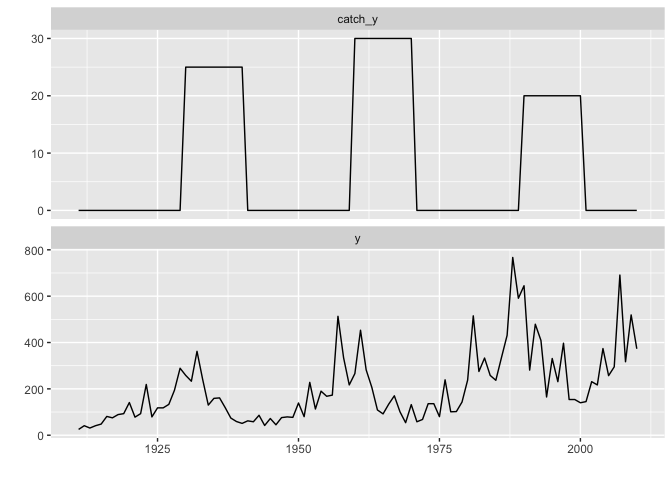
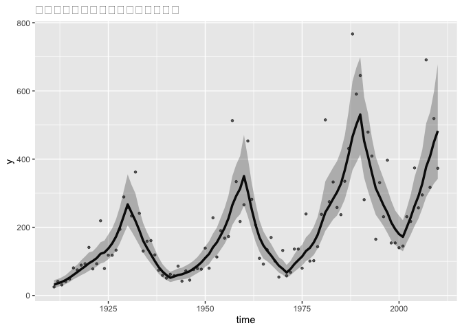

この章ではポアソン分布に従う観測値を対象とする。

ポアソン分布は、個体数や売上個数など、正の整数しかとらないデータに対して、
よく適用される確率分布。

## 4-1.この章で使うパッケージ

``` r
library(rstan)
library(ggplot2)
library(ggfortify)
```

``` r
rstan_options(auto_write = TRUE)
options(mc.cores = parallel::detectCores())
```

## 4-2.テーマ①　最適な捕獲頭数を求めたい

-   動物の個体数の調査データを対象。

    -   この動物は放っておくとひたすら増加する。
    -   そのため、大規模な駆除が数回行われている。
    -   ただし、在来種のため、絶滅させるわけにもいかない。

-   以上から、個体数が増えも減りもしない、ちょうど良い捕獲頭数の算出を目指す。

## 4-3.データの特徴

``` r
data_file <- read.csv("./data/6-4-animal_catch_data.csv")
head(data_file, n = 3)
```

    ##   time  y catch_y
    ## 1 1911 25       0
    ## 2 1912 41       0
    ## 3 1913 31       0

-   1年に1回、生物の個体数”y”と捕獲数”catch_y”が記録されたデータ。
-   ts型に変換し、図示する。

``` r
# ts型に変換
data_ts <- ts(data_file[, -1], start = 1911, frequency = 1)

# 図示
autoplot(data_ts)
```



-   大規模な駆除は計3回。
-   駆除が行われている間は個体数が減少している。
-   駆除対象は、子供を持つ親のため、増加トレンドを抑えることに成功している。
-   このデータは、「増加トレンド\~大規模な駆除」を繰り返すことが原因の大きな変化と細かいノイズで構成されている。
-   これは、調査方法に問題。遠くから双眼鏡を用いての計測だが、観測場所、調査者の計測能力といったムラが発生している。

## 4-4.モデルの構造を決める

-   モデルの検討。

    -   放っておくと個体数は増加する→トレンドがあるモデルが望ましい
    -   駆除しない限りはずっと増えるので、上昇トレンドの大きさは一定と仮定する。
    -   ただし、駆除イベントがあると、下降トレンドに変化。
    -   変化の大きさは、駆除された個体数によって変わる。

-   以上から、まずは、「ローカル線形トレンドモデル」を改造した以下のモデルを想定。

    -   *σ*<sub>*t*</sub>は*t*時点のトレンド。
    -   *T**r**e**n**d*は上昇トレンドの大きさ。(時点によらず一定)
    -   *C**o**e**f*<sub>*c**a**t**c**h*</sub>は捕獲数がトレンドに与える影響を表す係数。(時点によらず一定)
    -   *C**a**t**c**h*<sub>*t*</sub>は*t*時点の捕獲数。
    -   *μ*<sub>*t*</sub>は*t*時点の個体数の水準値(状態)。
    -   *y*<sub>*t*</sub>は*t*時点の観測された個体数。
    -   *w*<sub>*t*</sub>, *v*<sub>*t*</sub>は各々*t*時点の過程誤差と観測誤差。

$$
\begin{align}
\delta_t &= Trend - Coef\_{catch} \times Catch_t\\\\
\mu_t &= \mu\_{t-1} + \delta\_{t-1} + w_t, \~\~\~\~\~ w_t \sim N(0,\sigma_w^2) \\\\
y_t &= \mu_t + v_t, \~\~\~\~\~\~\~\~\~\~\~\~\~\~\~\~\~\~\~\~\~\~ v_t \sim N(0,\sigma_v^2)
\end{align}
$$

## 4-5.ポアソン分布＋ランダムエフェクト

-   観測値*y*<sub>*t*</sub>がポアソン分布に従っていると仮定。
-   先ほどの状態方程式・観測方程式を変更。

$$
\begin{align}
\delta_t &= Trend - Coef\_{catch} \times Catch_t\\\\
\mu_t &= \mu\_{t-1} + \delta\_{t-1} + w_t, \~\~\~\~\~ w_t \sim N(0,\sigma_w^2) \\\\
\lambda_t &= \exp(\mu_t) \\\\
y_t &\sim Poisson(\lambda_t)
\end{align}
$$

-   ポアソン分布は期待値も分散も1つのパラメタ*λ*である。

-   *λ*としてexp (*μ*<sub>*t*</sub>)を指定。

-   ポアソン分布に従う値が負になることが無い(個体数がマイナスになることはない)。

-   データに大きなノイズが見られたので、観測誤差をさらに追加。

$$
\begin{align}
\delta_t &= Trend - Coef\_{catch} \times Catch_t\\\\
\mu_t &= \mu\_{t-1} + \delta\_{t-1} + w_t, \~\~\~\~\~ w_t \sim N(0,\sigma_w^2) \\\\
\mu\\\_{noise_t} &= \mu_t + v_t,\~\~\~\~\~\~\~\~\~\~\~\~\~\~\~\~\~\~\~\~\~\~ v_t \sim N(0,\sigma_v^2) \\\\
\lambda_t &= \exp(\mu\\\_{noise_t}) \\\\
y_t &\sim Poisson(\lambda_t)
\end{align}
$$

-   *μ*\_*n**o**i**s**e*<sub>*t*</sub>は*t*時点の観測誤差の加わった個体数の水準値。

-   観測誤差を認めつつ、観測値がポアソン分布に従うモデルを作成する。

-   水準値に観測誤差を組み込んだが、一般化線形混合モデルにおいてランダムエフェクトと呼ばれる項と
    同じ意味を持つ。

-   ポアソン分布は期待値と分散が等しい。→「期待値が決まると分散が自動的に定まってしまう」

-   分散を別途増やす場合はモデル化が必要。

$$
\begin{align}
\delta_t &= Trend - Coef\_{catch} \times Catch_t\\\\
\mu_t &\sim N(\mu\_{t-1} + \delta\_{t-1}, \sigma_w^2) \\\\
\mu\\\_{noise_t} &\sim N(\mu_t,\sigma_v^2) \\\\
\lambda_t &= \exp(\mu\\\_{noise_t}) \\\\
y_t &\sim Poisson(\lambda_t)
\end{align}
$$

## 4-6.stanファイルの記述

-   data,parameters,modelブロックに追加して、以下の2つのブロックを指定。

#### transformed parametersブロック

-   “\~”は確率分布に従うの意であり、modelブロックに記載する内容。
-   “=”は単なるパラメタの変換を表す。これは、transformed
    parametersブロックに記載する。
-   modelブロック：ランダム性があるもの / transformed
    parametersブロック：ランダム性がないもの

#### generated quantitiesブロック

-   モデルを推定するならば不要だが、別の目的で推定したい値を記載する場所。
    →状態方程式・観測方程式には現れないものを指す。

-   今回の例題の場合、「観測誤差が大きい」という課題があったため、
    「観測誤差がなかったと仮定した時の水準値」についても調査をしてみる。

-   これを行うことで、データが平滑化され、個体群の増減の様子が明瞭になるはず。

## 4-7\~11.Stanファイルの記載

-   ファイル名：6-4-count-model.stan
-   可読性担保のため、ベクトル化は行っていない。

## 4-12.stanによるモデルの推定

## 4-13.推定されたパラメタの確認

``` r
# 結果の確認
options(max.print = 1000)
print(fit_stan_count, probs = c(0.25, 0.5, 0.975), digits = 1)
```

    ## Inference for Stan model: 6-4-count-model.
    ## 4 chains, each with iter=8000; warmup=4000; thin=10; 
    ## post-warmup draws per chain=400, total post-warmup draws=1600.
    ## 
    ##                       mean se_mean   sd     25%     50%   97.5% n_eff Rhat
    ## trend                  0.1     0.0  0.0     0.1     0.1     0.1  1499    1
    ## coef_catch_y           0.0     0.0  0.0     0.0     0.0     0.0  1572    1
    ## mu_zero                3.4     0.0  0.2     3.3     3.4     3.8  1603    1
    ## mu[1]                  3.4     0.0  0.2     3.3     3.4     3.8  1491    1
    ## mu[2]                  3.6     0.0  0.2     3.5     3.6     3.9  1612    1
    ## mu[3]                  3.7     0.0  0.2     3.6     3.7     4.0  1463    1
    ## mu[4]                  3.8     0.0  0.1     3.7     3.8     4.1  1583    1
    ## mu[5]                  4.0     0.0  0.1     3.9     4.0     4.2  1543    1
    ## mu[6]                  4.1     0.0  0.1     4.0     4.1     4.4  1603    1
    ## mu[7]                  4.2     0.0  0.1     4.1     4.2     4.5  1444    1
    ## mu[8]                  4.3     0.0  0.1     4.3     4.3     4.6  1421    1
    ## mu[9]                  4.5     0.0  0.1     4.4     4.4     4.7  1166    1
    ## mu[10]                 4.6     0.0  0.1     4.5     4.5     4.8  1099    1
    ## mu[11]                 4.6     0.0  0.1     4.5     4.6     4.9  1555    1
    ## mu[12]                 4.7     0.0  0.1     4.6     4.7     5.0  1552    1
    ## mu[13]                 4.8     0.0  0.1     4.7     4.8     5.1  1672    1
    ## mu[14]                 4.8     0.0  0.1     4.7     4.8     5.1  1648    1
    ## mu[15]                 4.9     0.0  0.1     4.8     4.9     5.2  1339    1
    ## mu[16]                 5.0     0.0  0.1     4.9     5.0     5.3  1412    1
    ## mu[17]                 5.2     0.0  0.1     5.1     5.2     5.4  1582    1
    ## mu[18]                 5.3     0.0  0.1     5.2     5.3     5.6  1701    1
    ## mu[19]                 5.5     0.0  0.1     5.4     5.5     5.7  1578    1
    ## mu[20]                 5.6     0.0  0.1     5.5     5.6     5.9  1529    1
    ## mu[21]                 5.5     0.0  0.1     5.4     5.5     5.8  1284    1
    ## mu[22]                 5.4     0.0  0.1     5.3     5.4     5.7  1233    1
    ## mu[23]                 5.3     0.0  0.1     5.2     5.3     5.5  1269    1
    ## mu[24]                 5.1     0.0  0.1     5.0     5.1     5.4  1421    1
    ## mu[25]                 4.9     0.0  0.1     4.8     4.9     5.2  1366    1
    ## mu[26]                 4.8     0.0  0.1     4.7     4.8     5.1  1488    1
    ## mu[27]                 4.6     0.0  0.1     4.5     4.6     4.9  1650    1
    ## mu[28]                 4.4     0.0  0.1     4.3     4.4     4.7  1673    1
    ## mu[29]                 4.2     0.0  0.1     4.1     4.2     4.5  1660    1
    ## mu[30]                 4.1     0.0  0.1     4.0     4.1     4.4  1690    1
    ## mu[31]                 3.9     0.0  0.1     3.8     4.0     4.2  1802    1
    ## mu[32]                 4.0     0.0  0.1     3.9     4.0     4.3  1573    1
    ## mu[33]                 4.1     0.0  0.1     4.0     4.1     4.4  1625    1
    ## mu[34]                 4.1     0.0  0.1     4.0     4.1     4.4  1205    1
    ## mu[35]                 4.2     0.0  0.1     4.1     4.2     4.5  1213    1
    ## mu[36]                 4.3     0.0  0.2     4.2     4.3     4.5  1197    1
    ## mu[37]                 4.4     0.0  0.1     4.3     4.4     4.6  1203    1
    ## mu[38]                 4.5     0.0  0.1     4.4     4.5     4.7  1289    1
    ## mu[39]                 4.6     0.0  0.1     4.5     4.6     4.8  1198    1
    ## mu[40]                 4.7     0.0  0.1     4.6     4.7     5.0  1513    1
    ## mu[41]                 4.8     0.0  0.1     4.7     4.8     5.1  1419    1
    ## mu[42]                 4.9     0.0  0.1     4.9     5.0     5.2  1560    1
    ## mu[43]                 5.0     0.0  0.1     5.0     5.0     5.3  1415    1
    ## mu[44]                 5.2     0.0  0.1     5.1     5.2     5.4  1407    1
    ## mu[45]                 5.3     0.0  0.1     5.2     5.3     5.5  1371    1
    ## mu[46]                 5.4     0.0  0.1     5.3     5.4     5.7  1507    1
    ## mu[47]                 5.6     0.0  0.1     5.5     5.6     5.9  1520    1
    ## mu[48]                 5.7     0.0  0.1     5.6     5.7     6.0  1611    1
    ## mu[49]                 5.7     0.0  0.1     5.7     5.7     6.0  1483    1
    ## mu[50]                 5.9     0.0  0.1     5.8     5.9     6.2  1539    1
    ## mu[51]                 5.7     0.0  0.1     5.6     5.7     6.0  1514    1
    ## mu[52]                 5.5     0.0  0.1     5.4     5.5     5.8  1523    1
    ## mu[53]                 5.3     0.0  0.1     5.2     5.3     5.6  1488    1
    ## mu[54]                 5.1     0.0  0.1     5.0     5.1     5.4  1149    1
    ## mu[55]                 5.0     0.0  0.1     4.9     5.0     5.2  1298    1
    ## mu[56]                 4.9     0.0  0.1     4.8     4.9     5.1  1501    1
    ## mu[57]                 4.8     0.0  0.1     4.7     4.8     5.0  1551    1
    ## mu[58]                 4.6     0.0  0.1     4.5     4.6     4.9  1572    1
    ## mu[59]                 4.5     0.0  0.1     4.4     4.5     4.7  1623    1
    ## mu[60]                 4.4     0.0  0.1     4.3     4.4     4.6  1484    1
    ## mu[61]                 4.2     0.0  0.1     4.1     4.2     4.5  1363    1
    ## mu[62]                 4.4     0.0  0.1     4.3     4.4     4.6  1545    1
    ## mu[63]                 4.5     0.0  0.1     4.4     4.5     4.8  1309    1
    ## mu[64]                 4.6     0.0  0.1     4.5     4.6     4.9  1356    1
    ## mu[65]                 4.7     0.0  0.1     4.6     4.7     5.0  1529    1
    ## mu[66]                 4.9     0.0  0.1     4.8     4.9     5.1  1479    1
    ## mu[67]                 4.9     0.0  0.1     4.9     4.9     5.2  1555    1
    ## mu[68]                 5.0     0.0  0.1     4.9     5.0     5.3  1457    1
    ## mu[69]                 5.2     0.0  0.1     5.1     5.2     5.4  1579    1
    ## mu[70]                 5.3     0.0  0.1     5.3     5.4     5.6  1193    1
    ## mu[71]                 5.5     0.0  0.1     5.4     5.5     5.8   855    1
    ## mu[72]                 5.6     0.0  0.1     5.5     5.6     5.9  1023    1
    ## mu[73]                 5.7     0.0  0.1     5.6     5.6     5.9  1300    1
    ## mu[74]                 5.7     0.0  0.1     5.6     5.7     6.0  1559    1
    ## mu[75]                 5.8     0.0  0.1     5.7     5.8     6.0  1534    1
    ## mu[76]                 5.9     0.0  0.1     5.8     5.9     6.2  1462    1
    ## mu[77]                 6.0     0.0  0.1     5.9     6.0     6.3  1398    1
    ## mu[78]                 6.2     0.0  0.1     6.0     6.1     6.4  1429    1
    ## mu[79]                 6.2     0.0  0.1     6.1     6.2     6.5  1391    1
    ## mu[80]                 6.3     0.0  0.1     6.2     6.3     6.5  1513    1
    ## mu[81]                 6.1     0.0  0.1     6.0     6.1     6.4  1462    1
    ## mu[82]                 6.0     0.0  0.1     5.9     6.0     6.3  1562    1
    ## mu[83]                 5.9     0.0  0.1     5.8     5.9     6.1  1290    1
    ## mu[84]                 5.7     0.0  0.1     5.7     5.8     6.0  1287    1
    ## mu[85]                 5.7     0.0  0.1     5.6     5.7     5.9  1517    1
    ## mu[86]                 5.6     0.0  0.1     5.5     5.6     5.8  1456    1
    ## mu[87]                 5.5     0.0  0.1     5.4     5.5     5.7  1410    1
    ## mu[88]                 5.4     0.0  0.1     5.3     5.4     5.6  1389    1
    ## mu[89]                 5.3     0.0  0.1     5.2     5.3     5.5  1327    1
    ## mu[90]                 5.2     0.0  0.1     5.1     5.2     5.5  1371    1
    ## mu[91]                 5.1     0.0  0.1     5.1     5.1     5.4  1411    1
    ## mu[92]                 5.3     0.0  0.1     5.2     5.3     5.5  1724    1
    ## mu[93]                 5.4     0.0  0.1     5.3     5.4     5.7  1504    1
    ## mu[94]                 5.6     0.0  0.1     5.5     5.6     5.8  1486    1
    ## mu[95]                 5.7     0.0  0.1     5.6     5.7     6.0  1515    1
    ## mu[96]                 5.8     0.0  0.1     5.7     5.8     6.1  1508    1
    ## mu[97]                 5.9     0.0  0.1     5.8     5.9     6.2  1247    1
    ## mu[98]                 6.0     0.0  0.1     5.9     6.0     6.3  1650    1
    ## mu[99]                 6.1     0.0  0.2     6.0     6.1     6.4  1540    1
    ## mu[100]                6.2     0.0  0.2     6.1     6.2     6.5  1658    1
    ## mu_noise[1]            3.3     0.0  0.2     3.2     3.3     3.6  1635    1
    ## mu_noise[2]            3.7     0.0  0.1     3.6     3.7     4.0  1755    1
    ## mu_noise[3]            3.5     0.0  0.2     3.4     3.5     3.8  1169    1
    ## mu_noise[4]            3.7     0.0  0.1     3.6     3.7     4.0  1581    1
    ## mu_noise[5]            3.9     0.0  0.1     3.8     3.9     4.1  1692    1
    ## mu_noise[6]            4.4     0.0  0.1     4.3     4.4     4.6  1459    1
    ## mu_noise[7]            4.3     0.0  0.1     4.2     4.3     4.5  1681    1
    ## mu_noise[8]            4.5     0.0  0.1     4.4     4.5     4.7  1303    1
    ## mu_noise[9]            4.5     0.0  0.1     4.4     4.5     4.7  1857    1
    ## mu_noise[10]           4.9     0.0  0.1     4.9     4.9     5.1  1311    1
    ## mu_noise[11]           4.4     0.0  0.1     4.3     4.4     4.6  1553    1
    ## mu_noise[12]           4.5     0.0  0.1     4.5     4.5     4.7  1554    1
    ## mu_noise[13]           5.4     0.0  0.1     5.3     5.4     5.5  1639    1
    ## mu_noise[14]           4.4     0.0  0.1     4.3     4.4     4.6  1321    1
    ## mu_noise[15]           4.8     0.0  0.1     4.7     4.8     4.9  1452    1
    ## mu_noise[16]           4.8     0.0  0.1     4.7     4.8     5.0  1311    1
    ## mu_noise[17]           4.9     0.0  0.1     4.8     4.9     5.1  1637    1
    ## mu_noise[18]           5.3     0.0  0.1     5.2     5.3     5.4  1760    1
    ## mu_noise[19]           5.7     0.0  0.1     5.6     5.7     5.8  1575    1
    ## mu_noise[20]           5.6     0.0  0.1     5.5     5.6     5.7  1473    1
    ## mu_noise[21]           5.4     0.0  0.1     5.4     5.4     5.6  1493    1
    ## mu_noise[22]           5.9     0.0  0.1     5.8     5.9     6.0  1659    1
    ##  [ reached getOption("max.print") -- omitted 382 rows ]
    ## 
    ## Samples were drawn using NUTS(diag_e) at Thu Feb  9 16:06:52 2023.
    ## For each parameter, n_eff is a crude measure of effective sample size,
    ## and Rhat is the potential scale reduction factor on split chains (at 
    ## convergence, Rhat=1).

-   最適な捕獲数、駆除がもたらす影響を確認

``` r
print(
  fit_stan_count,
  digits = 2,
  probs = c(0.025, 0.5, 0.975),
  pars = c("trend", "coef_catch_y", "best_catch_y")
)
```

    ## Inference for Stan model: 6-4-count-model.
    ## 4 chains, each with iter=8000; warmup=4000; thin=10; 
    ## post-warmup draws per chain=400, total post-warmup draws=1600.
    ## 
    ##               mean se_mean   sd 2.5%   50% 97.5% n_eff Rhat
    ## trend         0.11    0.00 0.02 0.07  0.11  0.14  1499    1
    ## coef_catch_y  0.01    0.00 0.00 0.01  0.01  0.01  1572    1
    ## best_catch_y 11.24    0.03 1.26 8.74 11.19 13.95  1320    1
    ## 
    ## Samples were drawn using NUTS(diag_e) at Thu Feb  9 16:06:52 2023.
    ## For each parameter, n_eff is a crude measure of effective sample size,
    ## and Rhat is the potential scale reduction factor on split chains (at 
    ## convergence, Rhat=1).

-   best_catch_yの結果より、約11頭/年を捕獲すると、個体数の安定が見込める。
-   95%信頼区間を考慮すると、約9\~14頭/年で調整するというのもあり。

## 4-14.平滑化された個体数の図示

-   平滑化された個体数を図示。

``` r
# 観測誤差を取り除いた状態の、95%信頼区間と中央値を抽出
sampling_result <- rstan::extract(fit_stan_count)

model_lambda_smooth <- t(apply(
  X = sampling_result$lambda_smooth,
  MARGIN = 2,
  FUN = quantile,
  probs=c(0.025, 0.5, 0.975)
))

colnames(model_lambda_smooth) <- c("lwr", "fit", "upr")
```

``` r
# データ整形
stan_df <- cbind(
  data.frame(y = data_file$y, time = data_file$time),
  as.data.frame(model_lambda_smooth)
)

# 図示
ggplot(data = stan_df, aes(x = time, y = y)) +
  labs(title = "観測誤差を取り除いた個体数の変動") +
  geom_point(alpha = 0.6, size = 0.9) +
  geom_line(aes(y = fit), size = 1.2) +
  geom_ribbon(aes(ymin = lwr, ymax = upr), alpha = 0.3)
```

    ## Warning: Using `size` aesthetic for lines was deprecated in ggplot2 3.4.0.
    ## ℹ Please use `linewidth` instead.



## 4-15.検討事項

-   駆除数はトレンドではなく水準値そのものに影響を及ぼすのではないか？

    -   最適駆除数は一定ではなくなり、その時の個体数に合わせて変化させる必要がある。
    -   トレンドと水準の両方に影響を及ぼしている可能性。

-   放っておけば無限に増殖するという前提は正しいか

    -   ローカル線形トレンドモデルのように変化するトレンドの検討。
    -   密度効果等を検討すべきかもしれない。
