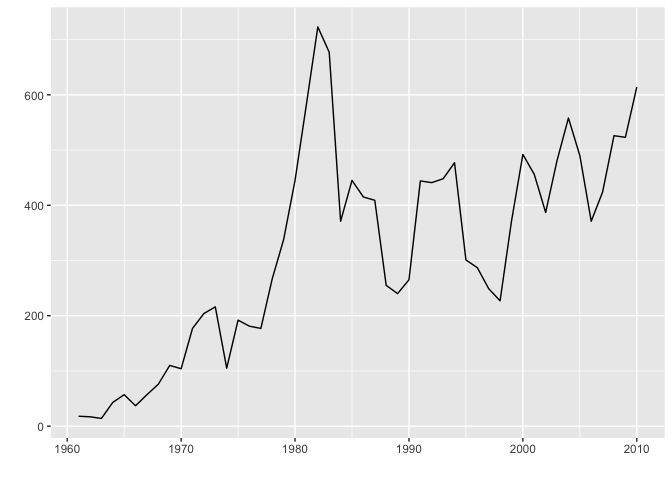
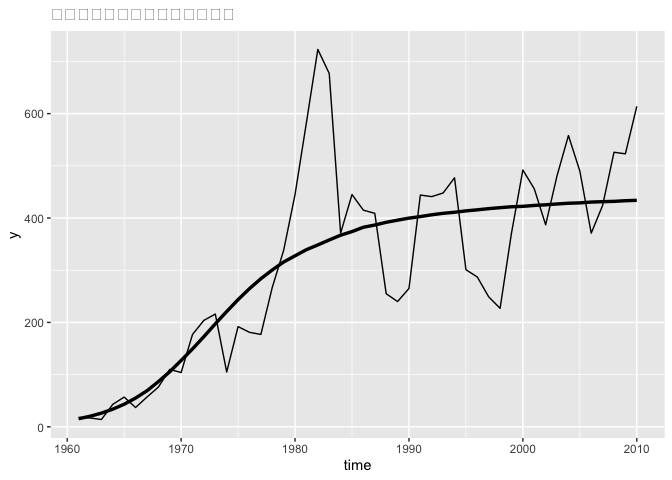

## 5-1.この章で使うパッケージおよび設定

``` r
library(rstan)
library(ggplot2)
library(ggfortify)
```

``` r
rstan_options(auto_write=TRUE)
options(mc.cores = parallel::detectCores())
```

## 5-2.テーマ② 密度効果をモデル化する

-   生物の個体数は、ある一定量で頭打ちになることがある。
-   個体数が増えることで、餌がなくなったり、糞等で環境が悪化するため。
-   個体数が増えすぎると自動的に増加にストップがかかることを「負の密度効果」という
-   密度効果については研究がされており、その知見をデータ分析に活用しようというのが
    この章のテーマ。

## 5-3.データの特徴

-   1回/年、生物の個体数yを記録した架空のデータ。（50年分）

``` r
data_file <- read.csv("./data/6-5-logistic-growth-data.csv")
head(data_file, n=3)
```

    ##   time  y
    ## 1 1961 18
    ## 2 1962 17
    ## 3 1963 14

-   図示してみると、右肩上がりのトレンドがあるようにも見えるし、400あたりで安定しているようにも見える。

``` r
# ts型に変換
data_ts <- ts(data_file[, -1], start = 1961, frequency = 1)
# 図示
autoplot(data_ts)
```



## 5-4.ロジスティック増殖曲線

-   離散時間のロジスティック増殖曲線は以下のように定式化。

    -   *N*<sub>*t*</sub>：*t*時点の生物の個体数
    -   r：内的自然増加率
    -   K：環境収容力

$$
N_t = N\_{t-1} + rN\_{t-1}\bigg(1 - \frac{N\_{t-1}}{K} \bigg)
$$

-   ロジスティック増殖曲線は個体群生態学では標準的なモデル。

-   上記式のような形式を”差分方程式”と呼ぶ。

    -   差分方程式：時間を経るにつれ、どのように個体数が変化していくかをみるのに便利。
    -   *N*<sub>*t*</sub> = *N*<sub>*t* − 1</sub>：前年の個体数と変化なし。
    -   *N*<sub>*t*</sub> = *N*<sub>*t* − 1</sub> + *r**N*<sub>*t* − 1</sub>：一定の増加率(内的自然増加率)で個体が増えていくことを表す。
    -   *N*<sub>*t* − 1</sub> \> *K*：前年個体数が環境収容力を上回ると、*r**N*<sub>*t* − 1</sub>(1−*N*<sub>*t* − 1</sub>/*K*) \< 0となる。つまり、前年よりも個体数は減少する。

-   個体数が増えれば増えるほど、負の密度効果が働いて、増加率が減少していく。
    これを表現したものがロジスティック増殖曲線である。状態空間モデルの式で表すと以下となる。

$$
\begin{align}
\mu_t &= \mu\_{t-1} + r\mu\_{t-1}\bigg( 1 - \frac{\mu\_{t-1}}{K} \bigg) + w_t, \~\~\~\~\~ w_t \sim N(0,\sigma_w^2) \\\\
\lambda_t &= \exp(\mu_t) \\\\
y_t &\sim Poisson(\lambda_t)
\end{align}
$$

-   過程誤差が加わったモデルとして表現されている。
-   「確率分布に従う」という形式にする。

$$
\begin{align}
\mu_t &\sim N(\mu\_{t-1} + r\mu\_{t-1}\bigg( 1 - \frac{\mu\_{t-1}}{K} \bigg),\sigma_w^2) \\\\
\lambda_t &= \exp(\mu_t) \\\\
y_t &\sim Poisson(\lambda_t)
\end{align}
$$

## 5-5.弱情報事前分布

-   少ないデータで複雑なモデルを推定すると、パラメタがうまく収束しないことがある。

-   こういった場合、“弱情報事前分布”を使う。

-   無情報事前分布を用いた場合は情報が不足してパラメタの収束が悪くなることがある。

-   弱情報事前分布：「パラメタはこのくらいに収まるのではないか」という範囲を指定する方法

-   今回の場合、環境収容力*K*に弱情報事前分布を適用する。
    (内的自然増加率に適用することも考えられる。)

-   範囲は、4\~10とする。

``` r
# Kの最大値
exp(10)
```

    ## [1] 22026.47

``` r
# データの最大値
max(data_file$y)
```

    ## [1] 723

-   環境収容力が10の時は、約22000が上限値となる。
-   データの最大値の3倍ほど。
-   この設定を変な値にすると、逆に収束がとても悪くなる。
-   弱情報事前分布として以下のように指定。

*K* ∼ *N*(7,3)

-   こうすると、1シグマ区間が4\~10になる。
-   厳密に範囲を指定するのではなく、想定された最大・最小値よりも幅が広くなることも許容している。

## 5-6\~10.stanファイルの作成

-   ファイル名：” 6-5-logistic-growth-model.stan ”

## 5-11.stanによるモデルの推定

### 5-12.推定されたパラメタの確認

``` r
options(max.print=1000)
print(fit_stan_growth, probs = c(0.025, 0.5, 0.975555), digits = 1)
```

    ## Inference for Stan model: 6-5-logistic-growth-model.
    ## 4 chains, each with iter=5000; warmup=2500; thin=5; 
    ## post-warmup draws per chain=500, total post-warmup draws=2000.
    ## 
    ##                      mean se_mean    sd    2.5%     50% 97.5555% n_eff Rhat
    ## r                     0.2     0.0   0.1     0.0     0.2      0.3  1911    1
    ## K                     6.2     0.0   0.7     5.6     6.1      7.7  1700    1
    ## mu_zero               2.7     0.0   0.3     2.1     2.7      3.4  2120    1
    ## mu[1]                 2.7     0.0   0.2     2.3     2.7      3.1  2043    1
    ## mu[2]                 2.9     0.0   0.2     2.5     2.9      3.2  2034    1
    ## mu[3]                 3.0     0.0   0.2     2.7     3.0      3.3  1966    1
    ## mu[4]                 3.6     0.0   0.1     3.4     3.6      3.9  1875    1
    ## mu[5]                 3.9     0.0   0.1     3.7     3.9      4.2  1910    1
    ## mu[6]                 3.8     0.0   0.1     3.5     3.8      4.0  1928    1
    ## mu[7]                 4.0     0.0   0.1     3.8     4.0      4.3  2033    1
    ## mu[8]                 4.3     0.0   0.1     4.1     4.3      4.5  1912    1
    ## mu[9]                 4.7     0.0   0.1     4.5     4.7      4.8  1780    1
    ## mu[10]                4.7     0.0   0.1     4.5     4.7      4.9  2026    1
    ## mu[11]                5.2     0.0   0.1     5.0     5.2      5.3  2174    1
    ## mu[12]                5.3     0.0   0.1     5.2     5.3      5.4  1887    1
    ## mu[13]                5.3     0.0   0.1     5.2     5.3      5.5  2128    1
    ## mu[14]                4.8     0.0   0.1     4.6     4.8      4.9  1673    1
    ## mu[15]                5.2     0.0   0.1     5.1     5.2      5.4  1978    1
    ## mu[16]                5.2     0.0   0.1     5.1     5.2      5.3  2009    1
    ## mu[17]                5.2     0.0   0.1     5.1     5.2      5.3  2086    1
    ## mu[18]                5.6     0.0   0.1     5.5     5.6      5.7  1929    1
    ## mu[19]                5.8     0.0   0.1     5.7     5.8      5.9  1903    1
    ## mu[20]                6.1     0.0   0.0     6.0     6.1      6.2  2100    1
    ## mu[21]                6.4     0.0   0.0     6.3     6.4      6.4  2022    1
    ## mu[22]                6.6     0.0   0.0     6.5     6.6      6.7  2146    1
    ## mu[23]                6.5     0.0   0.0     6.4     6.5      6.6  2136    1
    ## mu[24]                5.9     0.0   0.1     5.8     5.9      6.0  1980    1
    ## mu[25]                6.1     0.0   0.0     6.0     6.1      6.2  1925    1
    ## mu[26]                6.0     0.0   0.0     5.9     6.0      6.1  1945    1
    ## mu[27]                6.0     0.0   0.0     5.9     6.0      6.1  2037    1
    ## mu[28]                5.6     0.0   0.1     5.4     5.6      5.7  2107    1
    ## mu[29]                5.5     0.0   0.1     5.4     5.5      5.6  1996    1
    ## mu[30]                5.6     0.0   0.1     5.5     5.6      5.7  1954    1
    ## mu[31]                6.1     0.0   0.0     6.0     6.1      6.2  2061    1
    ## mu[32]                6.1     0.0   0.0     6.0     6.1      6.2  2080    1
    ## mu[33]                6.1     0.0   0.0     6.0     6.1      6.2  1921    1
    ## mu[34]                6.2     0.0   0.0     6.1     6.2      6.2  2159    1
    ## mu[35]                5.7     0.0   0.1     5.6     5.7      5.8  1771    1
    ## mu[36]                5.7     0.0   0.1     5.5     5.7      5.8  1868    1
    ## mu[37]                5.5     0.0   0.1     5.4     5.5      5.6  2125    1
    ## mu[38]                5.5     0.0   0.1     5.3     5.5      5.6  2078    1
    ## mu[39]                5.9     0.0   0.1     5.8     5.9      6.0  2018    1
    ## mu[40]                6.2     0.0   0.0     6.1     6.2      6.3  1976    1
    ## mu[41]                6.1     0.0   0.0     6.0     6.1      6.2  1919    1
    ## mu[42]                6.0     0.0   0.0     5.9     6.0      6.1  2062    1
    ## mu[43]                6.2     0.0   0.0     6.1     6.2      6.3  2023    1
    ## mu[44]                6.3     0.0   0.0     6.2     6.3      6.4  2137    1
    ## mu[45]                6.2     0.0   0.0     6.1     6.2      6.3  2082    1
    ## mu[46]                5.9     0.0   0.0     5.8     5.9      6.0  2040    1
    ## mu[47]                6.0     0.0   0.0     6.0     6.0      6.1  1993    1
    ## mu[48]                6.3     0.0   0.0     6.2     6.3      6.3  1881    1
    ## mu[49]                6.3     0.0   0.0     6.2     6.3      6.3  2081    1
    ## mu[50]                6.4     0.0   0.0     6.3     6.4      6.5  1981    1
    ## s_w                   0.1     0.0   0.0     0.0     0.1      0.1  1531    1
    ## lambda[1]            15.8     0.1   3.3    10.2    15.5     23.0  2046    1
    ## lambda[2]            17.7     0.1   3.1    12.5    17.5     24.5  2045    1
    ## lambda[3]            20.6     0.1   3.3    14.6    20.4     27.6  1980    1
    ## lambda[4]            38.3     0.1   5.0    29.1    38.2     48.7  1845    1
    ## lambda[5]            50.9     0.1   6.1    40.0    50.4     63.5  1915    1
    ## lambda[6]            43.5     0.1   5.4    33.8    43.3     54.6  1929    1
    ## lambda[7]            57.4     0.1   6.3    45.4    57.2     70.4  2034    1
    ## lambda[8]            76.9     0.2   7.9    62.5    76.4     93.9  1914    1
    ## lambda[9]           106.2     0.2   9.4    89.0   105.7    126.5  1784    1
    ## lambda[10]          109.5     0.2   9.5    92.4   109.0    129.6  2020    1
    ## lambda[11]          173.3     0.3  12.1   149.6   172.7    197.5  2181    1
    ## lambda[12]          202.7     0.3  13.7   177.8   202.1    231.5  1898    1
    ## lambda[13]          208.7     0.3  13.4   182.8   208.7    235.6  2124    1
    ## lambda[14]          118.5     0.2   9.9    99.5   118.4    138.0  1678    1
    ## lambda[15]          186.0     0.3  12.8   162.2   185.8    212.6  1966    1
    ## lambda[16]          181.4     0.3  12.6   157.0   181.2    206.6  1995    1
    ## lambda[17]          182.4     0.3  12.6   158.9   182.1    208.6  2098    1
    ## lambda[18]          265.4     0.4  15.8   235.7   265.0    296.9  1940    1
    ## lambda[19]          338.8     0.4  17.9   303.1   338.5    373.1  1894    1
    ## lambda[20]          443.8     0.4  20.3   405.8   443.7    484.4  2097    1
    ## lambda[21]          582.8     0.5  23.5   536.1   583.2    630.4  2019    1
    ## lambda[22]          720.4     0.6  26.7   669.0   720.1    775.0  2141    1
    ## lambda[23]          670.7     0.6  26.0   620.4   670.2    723.2  2137    1
    ## lambda[24]          379.1     0.4  19.2   341.5   379.1    418.9  1995    1
    ## lambda[25]          442.6     0.5  20.7   403.1   442.1    484.0  1933    1
    ## lambda[26]          415.3     0.4  19.6   377.7   414.8    454.8  1942    1
    ## lambda[27]          404.0     0.4  19.3   365.6   403.9    442.2  2031    1
    ## lambda[28]          259.8     0.3  15.5   230.5   259.4    292.0  2103    1
    ## lambda[29]          242.3     0.3  14.8   214.3   242.3    271.7  2000    1
    ## lambda[30]          270.4     0.4  15.8   240.8   269.7    302.5  1955    1
    ## lambda[31]          438.6     0.4  20.4   400.8   438.4    479.0  2065    1
    ## lambda[32]          440.7     0.5  20.8   401.0   440.5    482.3  2083    1
    ## lambda[33]          447.9     0.5  20.7   407.2   447.4    490.0  1912    1
    ## lambda[34]          471.9     0.5  21.4   431.5   471.2    515.0  2162    1
    ## lambda[35]          305.4     0.4  16.8   274.5   304.5    339.3  1773    1
    ## lambda[36]          285.8     0.4  16.8   253.7   285.5    319.1  1867    1
    ## lambda[37]          250.2     0.3  15.3   221.1   249.9    282.9  2127    1
    ## lambda[38]          233.7     0.3  14.6   205.8   233.2    263.0  2068    1
    ## lambda[39]          368.4     0.4  18.6   333.7   368.1    405.1  2023    1
    ## lambda[40]          487.7     0.5  21.3   447.2   487.2    530.8  1974    1
    ## lambda[41]          454.7     0.5  20.9   416.2   454.1    497.9  1917    1
    ## lambda[42]          391.9     0.4  19.0   355.3   391.8    428.7  2063    1
    ## lambda[43]          480.2     0.5  20.8   438.5   480.4    521.1  2023    1
    ## lambda[44]          553.7     0.5  23.2   508.8   553.7    601.3  2132    1
    ## lambda[45]          488.0     0.5  21.4   447.6   487.8    531.2  2087    1
    ## lambda[46]          374.9     0.4  18.2   338.0   375.2    411.9  2043    1
    ## lambda[47]          424.2     0.5  20.2   384.5   423.5    465.1  1991    1
    ## lambda[48]          523.4     0.5  22.6   480.5   522.5    571.0  1882    1
    ## lambda[49]          525.0     0.5  22.5   481.6   524.2    571.2  2075    1
    ## lambda[50]          611.1     0.5  24.3   564.1   610.5    660.4  1991    1
    ## mu_smooth[1]          2.7     0.0   0.3     2.1     2.7      3.4  2120    1
    ## mu_smooth[2]          3.0     0.0   0.3     2.3     3.0      3.6  2118    1
    ## mu_smooth[3]          3.2     0.0   0.4     2.5     3.3      4.0  2079    1
    ## mu_smooth[4]          3.5     0.0   0.4     2.7     3.5      4.3  2029    1
    ## mu_smooth[5]          3.7     0.0   0.4     2.8     3.8      4.6  1983    1
    ## mu_smooth[6]          4.0     0.0   0.5     3.0     4.0      4.9  1944    1
    ## mu_smooth[7]          4.2     0.0   0.5     3.1     4.2      5.1  1910    1
    ## mu_smooth[8]          4.4     0.0   0.6     3.2     4.5      5.3  1880    1
    ## mu_smooth[9]          4.6     0.0   0.6     3.3     4.7      5.5  1852    1
    ## mu_smooth[10]         4.8     0.0   0.6     3.4     4.8      5.7  1824    1
    ## mu_smooth[11]         4.9     0.0   0.6     3.5     5.0      5.8  1798    1
    ## mu_smooth[12]         5.0     0.0   0.6     3.6     5.2      5.9  1774    1
    ## mu_smooth[13]         5.2     0.0   0.6     3.6     5.3      5.9  1752    1
    ## mu_smooth[14]         5.3     0.0   0.6     3.7     5.4      6.0  1732    1
    ## mu_smooth[15]         5.3     0.0   0.6     3.8     5.5      6.1  1716    1
    ## mu_smooth[16]         5.4     0.0   0.6     3.9     5.6      6.1  1702    1
    ## mu_smooth[17]         5.5     0.0   0.6     3.9     5.6      6.2  1692    1
    ## mu_smooth[18]         5.6     0.0   0.5     4.0     5.7      6.2  1686    1
    ## mu_smooth[19]         5.6     0.0   0.5     4.1     5.8      6.3  1683    1
    ## mu_smooth[20]         5.7     0.0   0.5     4.2     5.8      6.3  1683    1
    ## mu_smooth[21]         5.7     0.0   0.5     4.3     5.8      6.4  1686    1
    ##  [ reached getOption("max.print") -- omitted 80 rows ]
    ## 
    ## Samples were drawn using NUTS(diag_e) at Thu Feb  9 18:29:18 2023.
    ## For each parameter, n_eff is a crude measure of effective sample size,
    ## and Rhat is the potential scale reduction factor on split chains (at 
    ## convergence, Rhat=1).

``` r
print(
  fit_stan_growth,
  digits = 2,
  probs = c(0.025,0.5,0.975),
  pars = c("r","K")
)
```

    ## Inference for Stan model: 6-5-logistic-growth-model.
    ## 4 chains, each with iter=5000; warmup=2500; thin=5; 
    ## post-warmup draws per chain=500, total post-warmup draws=2000.
    ## 
    ##   mean se_mean   sd 2.5%  50% 97.5% n_eff Rhat
    ## r 0.17    0.00 0.06 0.04 0.17  0.29  1911    1
    ## K 6.22    0.02 0.69 5.57 6.09  7.69  1700    1
    ## 
    ## Samples were drawn using NUTS(diag_e) at Thu Feb  9 18:29:18 2023.
    ## For each parameter, n_eff is a crude measure of effective sample size,
    ## and Rhat is the potential scale reduction factor on split chains (at 
    ## convergence, Rhat=1).

-   個体数の理論的な上限値を求めてみる。

``` r
sampling_result <- rstan::extract(fit_stan_growth)
exp(quantile(sampling_result$K, probs = c(0.1,0.5,0.9)))
```

    ##      10%      50%      90% 
    ## 318.7328 441.7687 777.1251

## 5-13.平滑化された個体数の図示

-   過程誤差が無いことを想定した理論上の個体群増加曲線を描く。
-   今回は推定値の中央値のみを用いる。

``` r
model_lambda_smooth <- apply(
  X = sampling_result$lambda_smooth,
  MARGIN = 2,
  FUN = median
)
```

``` r
# データの整形
stan_df <- data.frame(
  y = data_file$y,
  fit = model_lambda_smooth,
  time = data_file$time
)

# 図示
ggplot(data = stan_df, aes(x = time, y = y)) +
  labs(title = "誤差を取り除いた個体数の変動") +
  geom_line() +
  geom_line(aes(y = fit), size = 1.2)
```

    ## Warning: Using `size` aesthetic for lines was deprecated in ggplot2 3.4.0.
    ## ℹ Please use `linewidth` instead.


